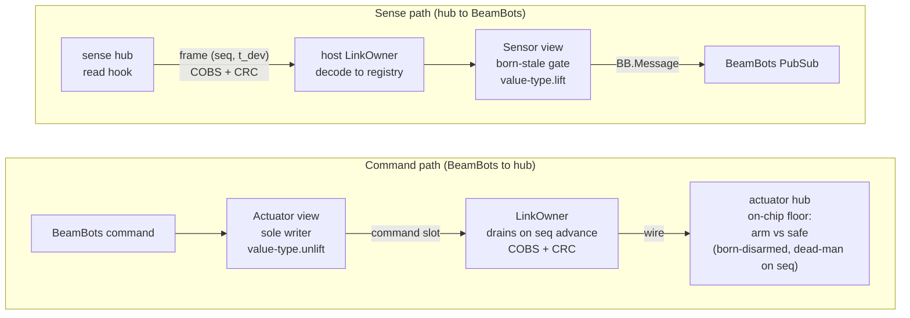

<p align="center">
  
</p>

# bb_mcuhub

<p align="center">
  <a href="https://github.com/lostbean/bb_mcuhub/actions/workflows/ci.yml"></a>
  <a href="LICENSE"></a>
   1.19">
</p>

**bb_mcuhub is an Elixir library (plus a C/ESP32 firmware kit) that connects a
[BeamBots](https://hex.pm/packages/bb) robot's Elixir brain to its
microcontrollers over a safe, drift-checked binary link — where each
microcontroller reads sensors and drives actuators behind an on-chip fail-safe
that stops the motors by itself if commands ever go silent.**

You're building a robot. An Elixir brain (on a Raspberry Pi or similar) needs to
talk to the microcontrollers that actually read the sensors and spin the motors.
`bb_mcuhub` is the wire and the safety layer between them. Its one idea is the
**hub** — _a single microcontroller node that reads sensors, drives actuators,
and forwards messages for child hubs._ Because every hub is the same shape, hubs
nest into a tree of any depth: the host talks over one UART to a root hub, which
bridges down to leaf hubs, each sensing, driving behind a floor, and forwarding
for its children.

It powers a real two-wheel self-balancing bot (`segby_v1`) on real ESP32 boards
today — and **you can run the entire host stack with zero hardware, or drive the
bot in a MuJoCo physics simulation with a 3-D viewer, no chassis required.**

> **Jargon, glossed once.** A **floor** is the dead-man safety code on an
> actuator's own chip: if commands stop arriving, it drives the actuator to its
> safe value and disarms, by itself. A **value-type** is a small reusable module
> that defines what bytes a kind of value puts on the wire and how those bytes
> become a typed Elixir message (and back) — your wire vocabulary. **seq** is a
> per-write counter the producing chip bumps by one on every new value; trust
> and the dead-man key off _"did this number advance"_, not off any clock. A
> **slot** is one `(node, port)` cell in the host's registry holding a port's
> latest value plus its seq. **Born-stale** means a reading is untrusted until
> its seq is seen advancing — freshness is earned, never assumed. Full glossary
> in [`CONTEXT.md`](CONTEXT.md).

---

## Features

**Safety, on the actuator's own chip**

- **Born-disarmed floor** — every actuator boots at its safe value and refuses
  to move until it sees a fresh command.
- **On-chip dead-man** — a yanked cable or crashed host stops the motors by
  itself; the host does nothing.
- **Knows when a reading is stale** — a sensor is trusted only while its values
  keep changing (each one carries a counter that ticks up); the moment they stop,
  it's treated as stale, not mistaken for live data — and no clocks to keep in
  sync.
- **Disarm-aware control loop** — a long-lived controller gates its own output
  on disarm, so it can't defeat the floor's command-silence e-stop.

**One model, two languages — they can't disagree**

- **Generated wire contract** — the C and Elixir sides of the codec are both
  emitted from one model; a build-failing **drift test** re-runs the generator
  and fails if committed artifacts don't match.
- **Cross-language parity** — the C codec is asserted to produce byte-identical
  frames + CRC to the Elixir side, in the test suite.
- **Correct framing** — COBS + CRC-16, explicitly big-endian; CAN
  segmentation/reassembly for bodies that exceed one frame.

**Host stack & developer experience**

- **Ordinary BeamBots components** — each hub port surfaces as a `BB.Sensor` /
  `BB.Actuator` view on normal PubSub topics; you publish and subscribe as
  usual.
- **Two small seams to extend** — author a **value-type** (your wire vocabulary)
  and write **one C hook per port**; everything safety-critical is generated.
- **Tree of any depth** — declare each hub's parent and uplink (UART or CAN);
  the route table and UART↔CAN bridging fall out, no gateway/router code to
  write.
- **Decoupled observability** — sample hub state into an observer plane at your
  own rate, with a pure reader and pluggable sinks (plus an optional `bb_tui`
  dashboard).

**Run it anywhere — board optional**

- **Zero-hardware loopback** — run the whole host stack in-process over the real
  COBS+CRC framing, no board attached (about 60 seconds).
- **MuJoCo physics simulation** — drive the real control stack against faithful
  dynamics with a native 3-D viewer; balance, drive, turn, and watch disarm drop
  it limp. Closes the sim-to-real gap (the controller you tune is the one that
  ships).
- **Portable C core** — the correctness-sensitive logic is freestanding C11;
  only a thin shim is platform-specific. ESP32 ships today; ports to other MCUs
  are welcome.

> **Is this for you?** Yes if you have an Elixir/BeamBots brain talking to its
> own microcontrollers and you want the wire + on-chip safety handled for you.
> **BeamBots** ([`bb`](https://hex.pm/packages/bb)) is the Elixir robotics
> framework this plugs into — it provides the robot DSL, PubSub, controllers,
> and the Sensor/Actuator component model; `bb_mcuhub` extends it, and each hub
> port surfaces as an ordinary BeamBots sensor/actuator **view** (a thin
> component wrapping the port). **Not** a general IoT bus, **not** a
> ROS/micro-ROS replacement, **not** a standalone framework — see
> [Status](#status--honest-maturity) for the honest maturity, the
> explicitly-deferred items, and the non-goals.

---

## What do I need?

**Hardware — minimum to first motion: one ESP32 + a motor driver, over a UART
link. No CAN, no transceiver.** The root hub speaks UART up to the host; child
links can be UART (point-to-point, no transceiver) or CAN (shared bus, needs a
transceiver). CAN is supported but optional — the worked example is UART-only.
And to just explore, **no hardware at all**: the
[zero-hardware Loopback](#run-it-with-zero-hardware-about-60-seconds) and the
[physics sim](#drive-it-in-a-physics-simulation-no-hardware-no-chassis) below
run the full stack on your desk.

**Toolchains — an honest heads-up.** This is **not a vanilla Elixir library.**
It deliberately crosses language and toolchain borders — Elixir ↔ generated C ↔
PlatformIO firmware ↔ (optionally) an embedded-Linux host — because that is
where the safety guarantees live. None of the tools is exotic, but each step
has its own; this table is the map (and the checklist when a cross-border step
fails):

| To do this…                         | You need…                                                                                                                                                                             |
| ----------------------------------- | ------------------------------------------------------------------------------------------------------------------------------------------------------------------------------------- |
| Use the library, run `mix test`     | Elixir 1.19+ **plus a C compiler and `make`** — the test suite host-compiles a test-only NIF of the real firmware C (no C ships to production)                                        |
| Build / flash the ESP32 firmware    | PlatformIO with the [`pioarduino`](https://github.com/pioarduino/platform-espressif32) fork (arduino-esp32 3.x / ESP-IDF 5.x); the first build downloads the toolchain                |
| Run the physics sim                 | Python 3.12 + [`uv`](https://docs.astral.sh/uv/) — **example-only**; the library and firmware ship no Python                                                                          |
| Put the host on a robot             | Any Linux + Elixir board; the worked example deploys with **Nerves** on a Raspberry Pi ([`BRINGUP.md`](https://github.com/lostbean/bb_mcuhub/blob/main/examples/segby_v1/BRINGUP.md)) |
| Have all of it pinned, reproducibly | `nix develop` (or `direnv allow`) — optional but recommended; see [Build & test](#build--test)                                                                                        |

**Nix is not required** — it's a convenience for a pinned, reproducible
toolchain; bring your own tools per the table if you prefer.

---

## Run it with zero hardware (about 60 seconds)

The library ships `BBMCUHub.Host.Transport.Loopback` (not test-only — it's in
`lib/`). It runs the whole host stack — views, command-slot writes, the link
owner's drain, and the _real_ COBS+CRC framing — entirely in-process. Try it
right now with the shipped example robot (no C toolchain needed here — the NIF
is test-only):

```sh
git clone https://github.com/lostbean/bb_mcuhub.git
cd bb_mcuhub/examples/segby_v1 && mix deps.get && iex -S mix
```

```elixir
# in that iex session (for your own robot, swap in robot: MyApp.Robot):
{:ok, _sup} =
  BBMCUHub.Host.start_link(
    robot: SegbyV1.Robot,
    transport: BBMCUHub.Host.Transport.Loopback
  )
```

Now each hub port is an ordinary BeamBots component: a sensor port is a
`BB.Sensor` view that publishes a typed `BB.Message` on its PubSub topic once
born-stale freshness passes; an actuator port is a `BB.Actuator` view that is
the sole writer of the command slot and subscribes to the command struct its
value-type names. You publish and subscribe through normal BeamBots PubSub
topics; the views translate to and from the wire — no board attached.

For safety/freshness behaviour specifically, the test seam
`BBMCUHub.Test.VirtualHub` runs the **actual firmware C floor + C wire path**
behind the host stack on explicit simulated time (`tick(vhub, now_ms)` is the
only clock — no wall-clock sleeps). See
[`test/host/soft_fault_e2e_test.exs`](test/host/soft_fault_e2e_test.exs) for a
worked fault-injection example.

---

## Drive it in a physics simulation (no hardware, no chassis)

The Loopback transport above runs the host stack but nothing _moves_. Go one
step further and run the **whole control loop against a real physics engine**:
the same host stack — codec, freshness, the floor's safe-state, the balance
loop, teleop — drives a [MuJoCo](https://mujoco.org/) model of the bot, and a
native 3-D viewer renders it while you fly it from the terminal dashboard. The
bot **balances, drives, and turns** — and disarming it visibly drops it limp.

```sh
# the worked example, starting from the repo root
# (needs Python 3.12 + uv — both in the devShell; see "What do I need?")
cd examples/segby_v1/sim && uv sync   # one-time: pulls MuJoCo into a local .venv
cd .. && mix segby.sim                # opens the 3-D viewer + the bb_tui dashboard
# in the dashboard: arm (a), run the :teleop command with forward/turn to drive;
# disarm (d) drops the wheels limp — the real floor safe-state.
```

The trick is the same **transport seam** the Loopback uses — _it is the one
hardware boundary._ The `BBMCUHub.Sim.*` seam (generic and engine-agnostic: a
`Sim.Plant` behaviour + a `Sim.Transport` + a ~50 Hz `Sim.Driver`, which this
example overrides to 100 Hz) replaces the wire, and a consumer-supplied `Plant`
supplies the dynamics — here a MuJoCo plant over a `Port` to a small Python
child. Everything above the transport is the real, shipped code, so the
controller you tune in the sim is the one that runs on the board. The
MuJoCo/Python dependency is **example-only** (opt-in via `uv`); the library and
firmware ship no Python.

This is what closes the **sim-to-real gap**: the balance gains, the teleop
mixing, the wheel-velocity loop, and the disarm safe-state are all developed and
de-risked here — against faithful dynamics, crashing for free — before a board
is ever powered. See [`examples/segby_v1/sim/`](https://github.com/lostbean/bb_mcuhub/tree/main/examples/segby_v1/sim) for the
full setup; the design rationale (the sim seam, drive-by-speed, disarm = host
silence) is in [`docs/hub-design.html`](docs/hub-design.html).

---

## What you write vs. what the library provides

A robot is assembled from a handful of small files in a strict order. Each piece
is small; the library does the mechanical, safety-critical work.

| You write (your project)                                     | The library provides                                           |
| ------------------------------------------------------------ | -------------------------------------------------------------- |
| **Value-types** (`use BBMCUHub.ValueType`) — your wire vocab | a stock set (`imu`, `effort`, `status`)                        |
| **Hub modules** (`use BBMCUHub.Hub`) — your ports            | the DSL, its intermediate model ("IR") + compile-time verifier |
| **A robot** (`use BB, extensions: [BBMCUHub.Dsl]`)           | the generic `BBMCUHub.Host` launcher                           |
| **One C hook per port** (fill a struct / apply a value)      | the **generated** route table, dispatch, floor, schedule       |

These are the two **seams** you extend without ever editing the library: a
value-type is a standalone, cross-bot module (wire layout + host
`lift`/`unlift` + the firmware-hook shape), and the per-hub firmware glue is
_generated from the model_, so the safety-critical seq/floor wiring is never
hand-written.

The everyday inner loop, when you change a port:

```
edit a port in a hub module  →  mix wire.gen  →  git commit
```

`mix wire.gen` needs only Elixir compiling your robot module — it reads the
robot's model and writes C headers into your tree (no device, no toolchain). A
drift test fails the build if committed artifacts don't match fresh generation,
so regen-and-commit is the routine, not a footnote.

---

## The smallest robot, end to end

Four short pieces. (The full balancing bot lives in
[`examples/segby_v1/`](https://github.com/lostbean/bb_mcuhub/tree/main/examples/segby_v1); the snippets below are real code
from it.)

### 1. A value-type — _what bytes a value puts on the wire_

A sense-only value-type is about ten lines: an ordered layout plus
`lift`/`unlift`. This declares that a range reading is one float on the wire.
([`range.ex`](examples/segby_v1/lib/segby_v1/value_types/range.ex))

```elixir
defmodule SegbyV1.ValueTypes.Range do
  use BBMCUHub.ValueType

  layout(distance_m: :f32)

  # identity when the raw field map IS the payload (see Led below for the
  # real-mapping case: a typed struct ↔ the wire field map)
  @impl BBMCUHub.ValueType
  def lift(map) when is_map(map), do: map

  @impl BBMCUHub.ValueType
  def unlift(map) when is_map(map), do: map
end
```

`lift`/`unlift` are identity here because the slot map _is_ the payload. They
become a genuine mapping when a typed struct is involved — the `Led` value-type
([`led.ex`](examples/segby_v1/lib/segby_v1/value_types/led.ex)) lifts
`%{r, g, b}` to a `SegbyV1.Messages.LedColor` struct and names it via
`command_message/0`, which is what an actuator view subscribes to on PubSub.

### 2. A hub port — _the one line that advertises the whole project_

If commands stop arriving, this motor floors to 0 N·m on its own chip.
([`wheels.ex`](examples/segby_v1/lib/segby_v1/hubs/wheels.ex))

```elixir
port(:motor_left,
  dir: :in,
  type: :effort,
  rate: 50,
  has_safe_action: true,
  safe_action: %{nm: 0.0},                  # ← the safe value the floor drives to
  step: {SegbyV1.Hubs.Wheels.Floor, :step}  # declared {module, fun} ref — data only
)
```

A command port _must_ declare `has_safe_action` (and `true` requires a
`safe_action` value of the port's own value-type), so a floored port is never
silently floorless — a forgotten safe action is a compile error, not a missing
dead-man.

### 3. The topology — _two lines define the tree_

You declare each hub's parent and uplink transport; the route table and UART↔CAN
bridging fall out of those pointers. No separate gateway/leaf/router code.
([`robot.ex`](examples/segby_v1/lib/segby_v1/robot.ex))

```elixir
hubs do
  hub(:blaster, SegbyV1.Hubs.Blaster, node: 0x02, parent: :host)
  hub(:wheels, SegbyV1.Hubs.Wheels, node: 0x05, parent: :blaster, uplink: :uart)
end
```

The **root hub** is just the one declared `parent: :host` — it owns the UART up
to the host and is otherwise an ordinary hub.

### 4. The one C hook per port — _fill a struct, return a bool_

The only C you write is one function per port. The value-type owns the
signature, the generator emits the prototype into `<hub>.device.h`, and you
implement it in `mcu/<hub>.cpp`. A sense hook fills a struct and returns `false`
on failure — and that makes the reader go stale.
([`blaster.cpp`](examples/segby_v1/firmware/mcu/blaster.cpp))

```c
extern "C" bool blaster_pose_read(Imu *out) {
  /* ...one-time lazy I2C init elided (see blaster.cpp)... */
  uint8_t b[14];
  if (!mpu_read(MPU9250_REG_ACCEL_XOUT_H, b, 14))
    return false;             // ← I2C burst failed: pose's seq stalls,
                              //    the reader goes stale, no garbage is trusted
  out->ax = /* ...scale raw bytes into engineering units... */;
  /* ...fill the rest of the struct... */
  return true;
}
```

The act side is the mirror — apply a value, no return. A single numeric field
passes by value; a multi-field value passes as `const <Struct> *`.
([`wheels.cpp`](examples/segby_v1/firmware/mcu/wheels.cpp))

```c
extern "C" void wheels_motor_left_drive(float effort) {
  if (!m0_ready)
    return;                                 // a motor that failed alignment is never touched
  m0_motor.target = torque_to_uq(effort);   // safe_action %{nm: 0.0} → drive(0.0)
  m0_motor.loopFOC();
  m0_motor.move();
}
```

That's the entire firmware seam: everything mechanical — the route table,
command dispatch, the floor plumbing, the schedule — is generated into
`<hub>.glue.h`.

For the full ordered walkthrough (the seven files, why each comes in that order,
and the external dependency forms), see
[`docs/NEW-ROBOT.md`](docs/NEW-ROBOT.md).

---

## Portable core, thin platform layer (ESP32 today — ports welcome)

The C is **not** tied to the ESP32. The correctness-sensitive logic is
freestanding C11; only a small hardware shim is platform-specific. (The
chassis's consumer contract — what `lib_deps` pulls in, which hooks you write —
is documented in [`firmware/README.md`](firmware/README.md).)

- **Portable core** (`firmware/src/*.c`, `firmware/include/*.h`) — the wire
  codec, CRC-16, COBS framing, CAN segmentation/reassembly, the route table, the
  cooperative scheduler, and the **safety floor** itself. These files include
  only `<stdint.h>` / `<stddef.h>` / `<stdbool.h>` / `<string.h>` — no
  `Arduino.h`, no `esp_*`, no FreeRTOS, no `driver/twai.h`. All integers are
  explicitly big-endian (`be_put_u16` …), so the wire format is endianness-safe
  across targets. The proof it is portable: `cd firmware/test && make`
  host-compiles these exact files with plain `cc -std=c11` (no ESP32 toolchain)
  and runs the floor/codec/segment harnesses — and the same files run behind the
  Elixir suite via the VirtualHub.
- **Platform layer** (`firmware/src/esp32/`) — only `link_esp32.cpp` and
  `hub_main.cpp` are ESP32/Arduino. They bind the core's abstract seams
  (send/recv a frame, a UART, the TWAI/CAN controller, a timer loop) to real
  hardware.

**Porting to another MCU** means reimplementing just that shim
(`firmware/src/<your_platform>/`) against the same seams and reusing the entire
core unchanged — the floor, the protocol, the generated glue all travel with
you. Today the ESP32 binding is the only one that ships; **PRs adding other
platform layers (STM32, nRF, RP2040, Linux/SocketCAN, …) are very welcome** —
keep the core files untouched and add a sibling under `firmware/src/`.

---

## Depending on it from your own project

In-tree, the example uses path/symlink deps. A real external consumer uses
ordinary published-package forms — **no shape change**.

**Elixir (`mix.exs`):**

```elixir
# in-tree example uses:  {:bb_mcuhub, path: "../.."}
# an external consumer:  {:bb_mcuhub, "~> 0.1"}        # Hex, when published
#                   or:  {:bb_mcuhub, github: "..."}   # git
{:bb, "~> 0.20"}                                       # the BeamBots framework
```

**Firmware (`platformio.ini`):**

```ini
# in-tree example uses:  lib_deps = symlink://../../../firmware   (repo-internal)
# an external consumer points lib_deps at the published firmware library
# (the PlatformIO registry, or a git URL) — it ships its own library.json.
```

BeamBots (the `bb` Hex package) is the Elixir robotics framework this plugs
into: it provides the robot DSL, PubSub, controllers/laws, and the
Sensor/Actuator component model. `bb_mcuhub` is a Spark DSL extension to it
(`use BB, extensions: [BBMCUHub.Dsl]`), **not a standalone system** — a robot is
a `use BB` module and the hub ports surface as ordinary BeamBots Sensor/Actuator
views.

---

## Build & test

A reproducible toolchain (Elixir, PlatformIO, clang/make) is pinned in
`flake.nix`. Either run `nix develop` (or `direnv allow`) in any worktree first,
**or** bring your own tools (see [What do I need?](#what-do-i-need)). Two
things worth knowing: PlatformIO downloads its ESP32 platform + toolchain into
a worktree-local `.pio-core` on first use (set `PLATFORMIO_CORE_DIR` to
override), and commit formatting is enforced via lefthook (`lefthook install`
once, inside the devShell).

| Stratum                | Command                                                    |
| ---------------------- | ---------------------------------------------------------- |
| Library (Elixir)       | `mix deps.get && mix test`                                 |
| Library C harnesses    | `cd firmware/test && make`                                 |
| Regenerate fixtures    | `mix wire.gen`                                             |
| Example (Elixir)       | `cd examples/segby_v1 && mix deps.get && mix test`         |
| Example ESP32 firmware | `cd examples/segby_v1/firmware && pio run -e blaster_root` |
| Everything CI runs     | `mix ci` — in the root and/or in `examples/segby_v1`       |

`mix test` builds and runs the C parity harness as part of the suite — the wire
cannot drift past it — so it **needs a C toolchain (`cc` + `make`)** even on a
pure-Elixir day. The library has no deployable ESP32 env of its own;
`firmware/` is a chassis library (`library.json`) a consumer pulls via
`lib_deps` — see [`firmware/README.md`](firmware/README.md) for the chassis
contract. `mix ci` is the one-command local gate (format check +
warnings-as-errors compile + full suite), the same thing
[CI](.github/workflows/ci.yml) runs.

Elixir 1.19+ is required: the declared `bb` requirement is `~> 0.20`, but the
repo locks (and CI tests against) `bb` 0.22+, which itself requires Elixir
`~> 1.19`.

### Troubleshooting the borders

The cross-language seams are where first runs stumble. The five failures worth
knowing by name:

- **`mix test` fails with a `make`/`cc` error** — you're missing a C toolchain.
  The library's suite host-compiles a test-only NIF of the real firmware C
  (`test/support/c_src/`); install `cc` + `make` or use `nix develop`. Nothing
  C is needed to _use_ the library in your app.
- **The drift test is red after you edited a hub/port/value-type** — that's the
  design working: committed generated artifacts no longer match the model. Run
  `mix wire.gen` and commit the regenerated files alongside your change.
- **The ESP32 firmware won't build / `pio` can't resolve the platform** — the
  chassis needs the [`pioarduino`](https://github.com/pioarduino/platform-espressif32)
  fork of `platform-espressif32` (arduino-esp32 3.x / ESP-IDF 5.x), not the
  stock one. Copy the example's `platformio.ini` or
  [`docs/templates/platformio.ini.example`](docs/templates/platformio.ini.example).
- **`bb` won't resolve / Elixir version errors** — you're below Elixir 1.19;
  see the version note above.
- **A board boot-loops with `task_wdt` resets** — that's the hardware watchdog
  doing its job on a wedged hub; see the explanation in
  [`firmware/README.md`](firmware/README.md).

---

## Status — honest maturity

**v1 is a small, robust, hardware-validated core.** It powers a real two-wheel
self-balancing bot (`segby_v1`) on real ESP32 boards today: IMU sensing,
dual-FOC motors, a host balance loop, and teleop. Implemented and tested (Elixir
suite + host-compiled C harnesses + the real-C-floor e2e seam): the wire path,
the on-chip floor, born-stale freshness, the generated contract + cross-language
parity, and CAN segmentation. The same control stack also runs in a **MuJoCo
physics simulation** (the `BBMCUHub.Sim` seam) where the balance/drive/disarm
behaviour is developed and regression-tested against faithful dynamics, no
hardware — see
[Drive it in a physics simulation](#drive-it-in-a-physics-simulation-no-hardware-no-chassis).

**Explicitly deferred** (each named in the design, each defaulting to the safe
behaviour): a `mix bb_mcuhub.gen.robot` scaffold (so v1 robot assembly is the
manual path in [`docs/NEW-ROBOT.md`](docs/NEW-ROBOT.md)); arm-nonce;
`fw_id`/board-identity (node identity is trust-on-first-use);
conflation/backpressure and wire-budget enforcement (v1 permits but does not
enforce right-rate); host coordination; CAN-FD; and stream-events observers (v1
observers are sample-state/poll only).

**Out of host-test scope by design** (they need the bench or QEMU): the watchdog
boot-loop and motor-sign calibration.

**Non-goals:** this is the wire + safety layer between an Elixir/BeamBots brain
and its microcontrollers. It is not a general IoT bus, not a ROS/micro-ROS
replacement, and not a standalone framework.

> There is an optional terminal dashboard (`bb_tui`) that shows live hub state,
> freshness, and arming, wired as Stage 5 of the example's
> [`BRINGUP.md`](https://github.com/lostbean/bb_mcuhub/blob/main/examples/segby_v1/BRINGUP.md) and live in the MuJoCo sim above.
> No screenshot is committed in this repo yet.

**Time to first motion, honestly:** assembling the software and watching the
loop run hardware-free over the Loopback transport is an afternoon for someone
comfortable with Elixir. First _real_ motion adds on-hardware bring-up
(flashing, wiring links, motor-sign calibration, closed-loop tuning) —
realistically a day or more of bench work, dominated by hardware calibration,
not the library.

---

## Under the hood

### How a port flows (end to end)



A **slot** is one `(node, port)` cell in the host's registry holding the latest
value plus its `seq`/timestamp. A **Status slot** is the slot a motor hub
publishes saying whether it is actually driving or floored.

### How it's verified (the full matrix)

| Layer             | What                                                                | Verified by                            |
| ----------------- | ------------------------------------------------------------------- | -------------------------------------- |
| Wire (Elixir)     | CRC-16, COBS, framing seam                                          | `test/wire/` (incl. property test)     |
| Wire (C)          | byte-identical codec + floor                                        | `firmware/test/` host harnesses        |
| Contract          | generator + drift + parity (per robot)                              | `test/gen/` + the example's drift test |
| Host              | registry, monitor (born-stale), link owner                          | `test/host/`                           |
| BeamBots          | `BB.Sensor` / `BB.Actuator` views (value-type-agnostic)             | `test/slice_test.exs`                  |
| Library self-test | a coverage-maximizing fixture robot (CAN+UART, a custom value-type) | `test/support/fixtures/`               |
| Example           | segby_v1 host + firmware as a real consumer                         | `examples/segby_v1/test/` + `pio run`  |

The **cross-language witness**: `mix test` builds and runs the C harness, which
asserts the C codec produces the _same_ bytes and CRC as the Elixir parity
vectors. The library self-tests in isolation via its fixture robot, which also
defines its own custom value-type — so the extension seam is CI-checked without
the example present.

### Repository layout

```
lib/bb_mcuhub/        the library — every consumer gets this, never edits it
  wire/               crc16 · cobs · framing_cobs · codec · stats
  contract/           layouts (wire-type widths) · port_index   (+ contract.ex)
  value_type/         imu · effort · status — the stock value-types
  value_type.ex       the `use BBMCUHub.ValueType` behaviour + atom→module resolve
  dsl.ex              the `hubs do` extension: IR projection + compile-time verifier
  gen/                wire_gen — the one generator
  hub.ex              `use BBMCUHub.Hub` — declare a hub's ports
  host.ex             the generic `BBMCUHub.Host` launcher (derives slots from the IR)
  host/               node_registry · monitor · link_owner · transport (+ loopback)
  sim/                plant (behaviour) · transport · driver — the sim-in-the-loop seam
  observer/           sample · sink(s) (+ observer.ex) — the decoupled observer plane
  bb_hub/             sensor · actuator — the value-type-agnostic BeamBots seam
firmware/             the C chassis, packaged as a PlatformIO library (library.json)
  include/ src/       crc16 · cobs · frame · transport · scheduler · router · floor · segment
  src/esp32/          link_esp32 · hub_main (Arduino/ESP32 glue)
  test/               host-compiled parity/floor/router/segment/uart harnesses
  gen/robot/          the fixture robot's generated artifacts (drift witnesses)
test/support/fixtures/  a coverage-maximizing fixture robot — the library self-test

examples/segby_v1/    the worked example — a separate Mix app (a consumer)
  lib/segby_v1/       SegbyV1.Robot · Hubs.{Blaster,Wheels} · ValueTypes.{Range,Led,WheelSpeed}
                      · Balance · Teleop · Sim (the MuJoCo plant) · Host (a thin
                      wrapper over BBMCUHub.Host)
  firmware/mcu/       the hand-authored device hooks (the only firmware a consumer writes)
  firmware/gen/       the example's generated glue + headers (drift-tested)
  firmware/platformio.ini   blaster_root + wheels_leaf — consume the chassis via lib_deps
```

The dependency arrow points only downward: library ← example. Everything under
any `gen/` is **generated, never hand-written**; everything under `mcu/` is the
consumer's device hooks.

---

## Where to go next

- [`CONTEXT.md`](CONTEXT.md) — the domain glossary (hub, floor, seq, value-type,
  slot, the frame…).
- [`docs/NEW-ROBOT.md`](docs/NEW-ROBOT.md) — build your own robot, the ordered
  seven-file walkthrough.
- [`docs/hub-design.html`](docs/hub-design.html) — the architecture and full
  rationale (an HTML page: download/clone and open it in a browser — GitHub
  shows only its source).
- [`examples/segby_v1/`](https://github.com/lostbean/bb_mcuhub/tree/main/examples/segby_v1) — the worked example, with its own
  [`BRINGUP.md`](https://github.com/lostbean/bb_mcuhub/blob/main/examples/segby_v1/BRINGUP.md) for on-hardware bring-up.
- [`firmware/README.md`](firmware/README.md) — the C chassis: what a firmware
  consumer gets, the hooks they write, and the two chassis rules.
