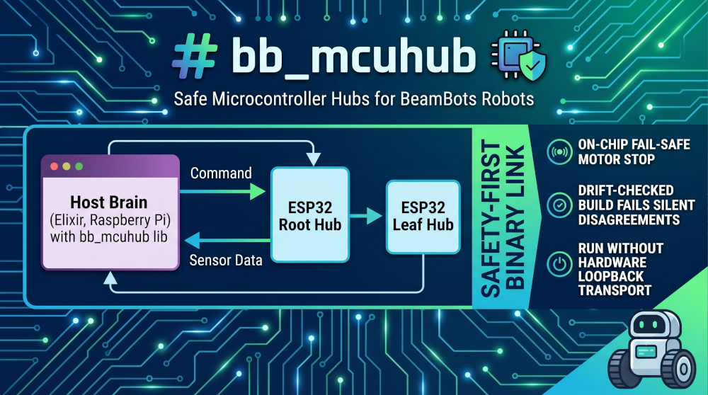
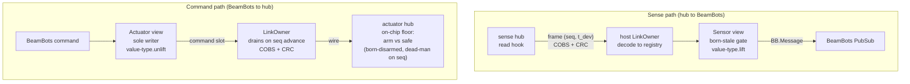

<p align="center">
  
</p>

# bb_mcuhub

**bb_mcuhub is an Elixir library (plus a C/ESP32 firmware kit) that connects a
[BeamBots](https://hex.pm/packages/bb) robot's Elixir brain to its
microcontrollers over a safe, drift-checked binary link — where each
microcontroller reads sensors and drives actuators behind an on-chip fail-safe
that stops the motors by itself if commands ever go silent.**

You're building a robot. An Elixir brain (on a Raspberry Pi or similar) needs to
talk to the microcontrollers that actually read the sensors and spin the motors.
`bb_mcuhub` is the wire and the safety layer between them — a host talks over one
UART to a tree of ESP32 hubs (a root hub that bridges down to leaf hubs), each
sensing, driving motors behind a floor, and forwarding for its children.

Its one idea is the **hub** — _a single microcontroller node that can read
sensors, drive actuators, and forward messages for child hubs._ Because every
hub is the same shape, hubs nest into a tree of any depth, from the host down to
a leaf on a wire.

What makes it trustworthy, in two sentences:

- Every actuator microcontroller is **born disarmed** — _it boots with its
  output already at the safe value and refuses to move until it sees a fresh
  command_ — and runs a dead-man on its own chip, so a yanked cable or crashed
  host stops the motors without the host doing anything.
- The C and Elixir sides of the wire format are both generated from one model,
  with a build-failing **drift test** — _a check that re-runs the code generator
  and fails if the committed C/Elixir artifacts don't match_ — so the two sides
  cannot silently disagree.

It powers a real two-wheel self-balancing bot (`segby_v1`) on real ESP32 boards
today, and **you can run the entire host stack with zero hardware — or drive the
bot in a MuJoCo physics simulation with a 3-D viewer, no chassis required.**

> **Jargon, glossed once.** A **floor** is the dead-man safety code on an
> actuator's own chip: if commands stop arriving, it drives the actuator to its
> safe value and disarms, by itself. A **value-type** is a small reusable module
> that defines what bytes a kind of value puts on the wire and how those bytes
> become a typed Elixir message (and back) — your wire vocabulary. **seq** is a
> per-write counter the producing chip bumps by one on every new value; trust
> and the dead-man key off _"did this number advance"_, not off any clock. Full
> glossary in [`CONTEXT.md`](CONTEXT.md).

---

## What hardware do I need?

**Minimum to first motion: one ESP32 + a motor driver, over a UART link. No CAN,
no transceiver.** The root hub speaks UART up to the host; child links can be
UART (point-to-point, no transceiver) or CAN (shared bus, needs a transceiver).
CAN is supported but optional — the worked example is UART-only.

**Prerequisites:** Elixir 1.18+ and the BeamBots `bb` framework on the host; an
ESP32 (arduino-esp32 3.x / ESP-IDF 5.x, via the `pioarduino` PlatformIO fork)
for firmware. **Nix is not required** — it's a convenience for a pinned,
reproducible toolchain (see [Build & test](#build--test)); bring your own Elixir
1.18+ and PlatformIO if you prefer.

---

## Run it with zero hardware (about 60 seconds)

The library ships `BBMCUHub.Host.Transport.Loopback` (not test-only — it's in
`lib/`). It runs the whole host stack — views, command-slot writes, the link
owner's drain, and the _real_ COBS+CRC framing — entirely in-process. Point the
launcher at it:

```elixir
# in iex -S mix, with a robot module on the path
{:ok, _sup} =
  BBMCUHub.Host.start_link(
    robot: MyApp.Robot,
    transport: BBMCUHub.Host.Transport.Loopback
  )
```

Now each hub port is an ordinary BeamBots component: a sensor port is a
`BB.Sensor` view that publishes a typed `BB.Message` on its PubSub topic once
born-stale freshness passes; an actuator port is a `BB.Actuator` view that is
the sole writer of the command slot and subscribes to the command struct its
value-type names. You publish and subscribe through normal BeamBots PubSub
topics; the views translate to and from the wire — no board attached.

For safety/freshness behaviour specifically, the test seam
`BBMCUHub.Test.VirtualHub` runs the **actual firmware C floor + C wire path**
behind the host stack on explicit simulated time (`tick(vhub, now_ms)` is the
only clock — no wall-clock sleeps). See
[`test/host/soft_fault_e2e_test.exs`](test/host/soft_fault_e2e_test.exs) for a
worked fault-injection example.

---

## Drive it in a physics simulation (no hardware, no chassis)

The Loopback transport above runs the host stack but nothing _moves_. Go one step
further and run the **whole control loop against a real physics engine**: the same
host stack — codec, freshness, the floor's safe-state, the balance loop, teleop —
drives a [MuJoCo](https://mujoco.org/) model of the bot, and a native 3-D viewer
renders it while you fly it from the terminal dashboard. The bot **balances,
drives, and turns** — and disarming it visibly drops it limp.

```sh
cd examples/segby_v1/sim && uv sync      # one-time: pulls MuJoCo into a local .venv
cd examples/segby_v1 && mix segby.sim     # opens the 3-D viewer + the bb_tui dashboard
# in the dashboard: arm (a), run the :teleop command with forward/turn to drive;
# disarm (d) drops the wheels limp — the real floor safe-state.
```

The trick is the same **transport seam** the Loopback uses — _it is the one
hardware boundary._ A `BBMCUHub.Sim` transport (a generic, engine-agnostic library
seam: a `Plant` behaviour + a transport + a ~100 Hz driver) replaces the wire, and
a consumer-supplied `Plant` supplies the dynamics — here a MuJoCo plant over a
`Port` to a small Python child. Everything above the transport is the real,
shipped code, so the controller you tune in the sim is the one that runs on the
board. The MuJoCo/Python dependency is **example-only** (opt-in via `uv`); the
library and firmware ship no Python.

This is what closes the **sim-to-real gap**: the balance gains, the teleop
mixing, the wheel-velocity loop, and the disarm safe-state are all developed and
de-risked here — against faithful dynamics, crashing for free — before a board is
ever powered. See [ADR-0008](docs/adr/0008-virtual-robot-sim-in-the-loop.md) (the
sim seam), [ADR-0009](docs/adr/0009-wheel-velocity-sensor-and-host-velocity-loop.md)
(drive-by-speed), and [ADR-0010](docs/adr/0010-a-control-loop-falls-silent-on-disarm.md)
(disarm = host silence), or [`examples/segby_v1/sim/`](examples/segby_v1/sim/) for
the full setup.

---

## What you write vs. what the library provides

A robot is assembled from a handful of small files in a strict order. Each piece
is small; the library does the mechanical, safety-critical work.

| You write (your project)                                     | The library provides                                     |
| ------------------------------------------------------------ | -------------------------------------------------------- |
| **Value-types** (`use BBMCUHub.ValueType`) — your wire vocab | a stock set (`imu`, `effort`, `status`)                  |
| **Hub modules** (`use BBMCUHub.Hub`) — your ports            | the DSL, the IR projection + compile-time verifier       |
| **A robot** (`use BB, extensions: [BBMCUHub.Dsl]`)           | the generic `BBMCUHub.Host` launcher                     |
| **One C hook per port** (fill a struct / apply a value)      | the **generated** route table, dispatch, floor, schedule |

These are the two **seams** you extend without ever editing the library: a
value-type is a standalone, cross-bot module (wire layout + host
`lift`/`unlift` - the firmware-hook shape), and the per-hub firmware glue is
_generated from the model_, so the safety-critical seq/floor wiring is never
hand-written.

The everyday inner loop, when you change a port:

```
edit a port in a hub module  →  mix wire.gen  →  git commit
```

`mix wire.gen` needs only Elixir compiling your robot module — it reads the
robot's model and writes C headers into your tree (no device, no toolchain). A
drift test fails the build if committed artifacts don't match fresh generation,
so regen-and-commit is the routine, not a footnote.

---

## The smallest robot, end to end

Four short pieces. (The full balancing bot lives in
[`examples/segby_v1/`](examples/segby_v1/); the snippets below are real code
from it.)

### 1. A value-type — _what bytes a value puts on the wire_

A sense-only value-type is about ten lines: an ordered layout plus
`lift`/`unlift`. This declares that a range reading is one float on the wire.
([`range.ex`](examples/segby_v1/lib/segby_v1/value_types/range.ex))

```elixir
defmodule SegbyV1.ValueTypes.Range do
  use BBMCUHub.ValueType

  layout(distance_m: :f32)

  # identity when the raw field map IS the payload (see Led below for the
  # real-mapping case: a typed struct ↔ the wire field map)
  @impl BBMCUHub.ValueType
  def lift(map) when is_map(map), do: map

  @impl BBMCUHub.ValueType
  def unlift(map) when is_map(map), do: map
end
```

`lift`/`unlift` are identity here because the slot map _is_ the payload. They
become a genuine mapping when a typed struct is involved — the `Led` value-type
([`led.ex`](examples/segby_v1/lib/segby_v1/value_types/led.ex)) lifts
`%{r, g, b}` to a `SegbyV1.Messages.LedColor` struct and names it via
`command_message/0`, which is what an actuator view subscribes to on PubSub.

### 2. A hub port — _the one line that advertises the whole project_

If commands stop arriving, this motor floors to 0 N·m on its own chip.
([`wheels.ex`](examples/segby_v1/lib/segby_v1/hubs/wheels.ex))

```elixir
port(:motor_left,
  dir: :in,
  type: :effort,
  rate: 50,
  has_safe_action: true,
  safe_action: %{nm: 0.0}   # ← the safe value the floor drives to
)
```

A command port _must_ declare `has_safe_action` (and `true` requires a
`safe_action` value of the port's own value-type), so a floored port is never
silently floorless — a forgotten safe action is a compile error, not a missing
dead-man.

### 3. The topology — _two lines define the tree_

You declare each hub's parent and uplink transport; the route table and UART↔CAN
bridging fall out of those pointers. No separate gateway/leaf/router code.
([`robot.ex`](examples/segby_v1/lib/segby_v1/robot.ex))

```elixir
hubs do
  hub(:blaster, SegbyV1.Hubs.Blaster, node: 0x02, parent: :host)
  hub(:wheels, SegbyV1.Hubs.Wheels, node: 0x05, parent: :blaster, uplink: :uart)
end
```

The **root hub** is just the one declared `parent: :host` — it owns the UART up
to the host and is otherwise an ordinary hub.

### 4. The one C hook per port — _fill a struct, return a bool_

The only C you write is one function per port. The value-type owns the
signature, the generator emits the prototype into `<hub>.device.h`, and you
implement it in `mcu/<hub>.cpp`. A sense hook fills a struct and returns `false`
on failure — and that makes the reader go stale.
([`blaster.cpp`](examples/segby_v1/firmware/mcu/blaster.cpp))

```c
extern "C" bool blaster_pose_read(Imu *out) {
  uint8_t b[14];
  if (!mpu_read(MPU9250_REG_ACCEL_XOUT_H, b, 14))
    return false;             // ← I2C burst failed: pose's seq stalls,
                              //    the reader goes stale, no garbage is trusted
  out->ax = /* ...scale raw bytes into engineering units... */;
  /* ...fill the rest of the struct... */
  return true;
}
```

The act side is the mirror — apply a value, no return. A single numeric field
passes by value; a multi-field value passes as `const <Struct> *`.
([`wheels.cpp`](examples/segby_v1/firmware/mcu/wheels.cpp))

```c
extern "C" void wheels_motor_left_drive(float effort) {
  m0_motor.target = torque_to_uq(effort);   // safe_action %{nm: 0.0} → drive(0.0)
  m0_motor.loopFOC();
  m0_motor.move();
}
```

That's the entire firmware seam: everything mechanical — the route table,
command dispatch, the floor plumbing, the schedule — is generated into
`<hub>.glue.h`.

For the full ordered walkthrough (the seven files, why each comes in that order,
and the external dependency forms), see
[`docs/NEW-ROBOT.md`](docs/NEW-ROBOT.md).

---

## Portable core, thin platform layer (ESP32 today — ports welcome)

The C is **not** tied to the ESP32. The correctness-sensitive logic is
freestanding C11; only a small hardware shim is platform-specific.

- **Portable core** (`firmware/src/*.c`, `firmware/include/*.h`) — the wire codec,
  CRC-16, COBS framing, CAN segmentation/reassembly, the route table, the
  cooperative scheduler, and the **safety floor** itself. These files include only
  `<stdint.h>` / `<stddef.h>` / `<stdbool.h>` / `<string.h>` — no `Arduino.h`, no
  `esp_*`, no FreeRTOS, no `driver/twai.h`. All integers are explicitly big-endian
  (`be_put_u16` …), so the wire format is endianness-safe across targets. The proof
  it is portable: `cd firmware/test && make` host-compiles these exact files with
  plain `cc -std=c11` (no ESP32 toolchain) and runs the floor/codec/segment
  harnesses — and the same files run behind the Elixir suite via the VirtualHub.
- **Platform layer** (`firmware/src/esp32/`) — only `link_esp32.cpp` and
  `hub_main.cpp` are ESP32/Arduino. They bind the core's abstract seams (send/recv a
  frame, a UART, the TWAI/CAN controller, a timer loop) to real hardware.

**Porting to another MCU** means reimplementing just that shim
(`firmware/src/<your_platform>/`) against the same seams and reusing the entire
core unchanged — the floor, the protocol, the generated glue all travel with you.
Today the ESP32 binding is the only one that ships; **PRs adding other platform
layers (STM32, nRF, RP2040, Linux/SocketCAN, …) are very welcome** — keep the core
files untouched and add a sibling under `firmware/src/`.

---

## Depending on it from your own project

In-tree, the example uses path/symlink deps. A real external consumer uses
ordinary published-package forms — **no shape change**.

**Elixir (`mix.exs`):**

```elixir
# in-tree example uses:  {:bb_mcuhub, path: "../.."}
# an external consumer:  {:bb_mcuhub, "~> 0.1"}        # Hex, when published
#                   or:  {:bb_mcuhub, github: "..."}   # git
{:bb, "~> 0.20"}                                       # the BeamBots framework
```

**Firmware (`platformio.ini`):**

```ini
# in-tree example uses:  lib_deps = symlink://../../../firmware   (repo-internal)
# an external consumer points lib_deps at the published firmware library
# (the PlatformIO registry, or a git URL) — it ships its own library.json.
```

BeamBots (the `bb` Hex package) is the Elixir robotics framework this plugs
into: it provides the robot DSL, PubSub, controllers/laws, and the
Sensor/Actuator component model. `bb_mcuhub` is a Spark DSL extension to it
(`use BB, extensions: [BBMCUHub.Dsl]`), **not a standalone system** — a robot is
a `use BB` module and the hub ports surface as ordinary BeamBots Sensor/Actuator
views.

---

## Build & test

A reproducible toolchain (Elixir, PlatformIO, clang/make) is pinned in
`flake.nix`. Either run `nix develop` (or `direnv allow`) in any worktree first,
**or** bring your own Elixir 1.18+ and PlatformIO. See `CLAUDE.md`.

| Stratum                | Command                                                    |
| ---------------------- | ---------------------------------------------------------- |
| Library (Elixir)       | `mix deps.get && mix test`                                 |
| Library C harnesses    | `cd firmware/test && make`                                 |
| Regenerate fixtures    | `mix wire.gen`                                             |
| Example (Elixir)       | `cd examples/segby_v1 && mix deps.get && mix test`         |
| Example ESP32 firmware | `cd examples/segby_v1/firmware && pio run -e blaster_root` |

`mix test` builds and runs the C parity harness as part of the suite — the wire
cannot drift past it. The library has no deployable ESP32 env of its own;
`firmware/` is a chassis library (`library.json`) a consumer pulls via
`lib_deps`.

Elixir 1.18+ is required. (The `bb` dependency requests 1.19; it runs fine on
1.18 — the requirement is a compile-time warning only.)

---

## Status — honest maturity

**v1 is a small, robust, hardware-validated core.** It powers a real two-wheel
self-balancing bot (`segby_v1`) on real ESP32 boards today: IMU sensing,
dual-FOC motors, a host balance loop, and teleop. Implemented and tested (Elixir
suite + host-compiled C harnesses + the real-C-floor e2e seam): the wire path,
the on-chip floor, born-stale freshness, the generated contract + cross-language
parity, and CAN segmentation. The same control stack also runs in a **MuJoCo
physics simulation** (the `BBMCUHub.Sim` seam) where the balance/drive/disarm
behaviour is developed and regression-tested against faithful dynamics, no
hardware — see [Drive it in a physics simulation](#drive-it-in-a-physics-simulation-no-hardware-no-chassis).

**Explicitly deferred** (each named in the design, each defaulting to the safe
behaviour): a `mix bb_mcuhub.gen.robot` scaffold (so v1 robot assembly is the
manual path in [`docs/NEW-ROBOT.md`](docs/NEW-ROBOT.md)); arm-nonce;
`fw_id`/board-identity (node identity is trust-on-first-use);
conflation/backpressure and wire-budget enforcement (v1 permits but does not
enforce right-rate); host coordination; CAN-FD; and stream-events observers (v1
observers are sample-state/poll only).

**Out of host-test scope by design** (they need the bench or QEMU): the watchdog
boot-loop and motor-sign calibration.

**Non-goals:** this is the wire + safety layer between an Elixir/BeamBots brain
and its microcontrollers. It is not a general IoT bus, not a ROS/micro-ROS
replacement, and not a standalone framework.

> There is an optional terminal dashboard (`bb_tui`) that shows live hub state,
> freshness, and arming, wired as Stage 5 of the example's
> [`BRINGUP.md`](examples/segby_v1/BRINGUP.md) and live in the MuJoCo sim above.
> No screenshot is committed in this repo yet.

**Time to first motion, honestly:** assembling the software and watching the
loop run hardware-free over the Loopback transport is an afternoon for someone
comfortable with Elixir. First _real_ motion adds on-hardware bring-up
(flashing, wiring links, motor-sign calibration, closed-loop tuning) —
realistically a day or more of bench work, dominated by hardware calibration,
not the library.

---

<details>
<summary><b>How a port flows (end to end)</b></summary>



A **slot** is one `(node, port)` cell in the host's registry holding the latest
value plus its `seq`/timestamp. A **Status slot** is the slot a motor hub
publishes saying whether it is actually driving or floored.

</details>

<details>
<summary><b>How it's verified (the full matrix)</b></summary>

| Layer             | What                                                                | Verified by                            |
| ----------------- | ------------------------------------------------------------------- | -------------------------------------- |
| Wire (Elixir)     | CRC-16, COBS, framing seam                                          | `test/wire/` (incl. property test)     |
| Wire (C)          | byte-identical codec + floor                                        | `firmware/test/` host harnesses        |
| Contract          | generator + drift + parity (per robot)                              | `test/gen/` + the example's drift test |
| Host              | registry, monitor (born-stale), link owner                          | `test/host/`                           |
| BeamBots          | `BB.Sensor` / `BB.Actuator` views (value-type-agnostic)             | `test/slice_test.exs`                  |
| Library self-test | a coverage-maximizing fixture robot (CAN+UART, a custom value-type) | `test/support/fixtures/`               |
| Example           | segby_v1 host + firmware as a real consumer                         | `examples/segby_v1/test/` + `pio run`  |

The **cross-language witness**: `mix test` builds and runs the C harness, which
asserts the C codec produces the _same_ bytes and CRC as the Elixir parity
vectors. The library self-tests in isolation via its fixture robot, which also
defines its own custom value-type — so the extension seam is CI-checked without
the example present.

</details>

<details>
<summary><b>Repository layout</b></summary>

```
lib/bb_mcuhub/        the library — every consumer gets this, never edits it
  wire/               crc16 · cobs · framing_cobs · codec · stats
  contract/           layouts (wire-type widths) · port_index   (+ contract.ex)
  value_type/         imu · effort · status — the stock value-types
  value_type.ex       the `use BBMCUHub.ValueType` behaviour + atom→module resolve
  dsl.ex              the `hubs do` extension: IR projection + compile-time verifier
  gen/                wire_gen — the one generator
  hub.ex              `use BBMCUHub.Hub` — declare a hub's ports
  host.ex             the generic `BBMCUHub.Host` launcher (derives slots from the IR)
  host/               node_registry · monitor · link_owner · transport (+ loopback)
  bb_hub/             sensor · actuator — the value-type-agnostic BeamBots seam
firmware/             the C chassis, packaged as a PlatformIO library (library.json)
  include/ src/       crc16 · cobs · frame · transport · scheduler · router · floor · segment
  src/esp32/          link_esp32 · hub_main (Arduino/ESP32 glue)
  test/               host-compiled parity/floor/router/segment/uart harnesses
  gen/robot/          the fixture robot's generated artifacts (drift witnesses)
test/support/fixtures/  a coverage-maximizing fixture robot — the library self-test

examples/segby_v1/    the worked example — a separate Mix app (a consumer)
  lib/segby_v1/       SegbyV1.Robot · Hubs.{Blaster,Wheels} · ValueTypes.{Range,Led}
                      · Balance · Teleop · Host (a thin wrapper over BBMCUHub.Host)
  firmware/mcu/       the hand-authored device hooks (the only firmware a consumer writes)
  firmware/gen/       the example's generated glue + headers (drift-tested)
  firmware/platformio.ini   blaster_root + wheels_leaf — consume the chassis via lib_deps
```

The dependency arrow points only downward: library ← example. Everything under
any `gen/` is **generated, never hand-written**; everything under `mcu/` is the
consumer's device hooks.

</details>

---

## Where to go next

- [`CONTEXT.md`](CONTEXT.md) — the domain glossary (hub, floor, seq, value-type,
  slot, the frame…).
- [`docs/NEW-ROBOT.md`](docs/NEW-ROBOT.md) — build your own robot, the ordered
  seven-file walkthrough.
- [`docs/hub-design.html`](docs/hub-design.html) — the architecture and full
  rationale.
- [`examples/segby_v1/`](examples/segby_v1/) — the worked example, with its own
  [`BRINGUP.md`](examples/segby_v1/BRINGUP.md) for on-hardware bring-up.
- `docs/adr/` — the recorded decisions (the library/example split, safe-action
  as a value, declared topology, …).
