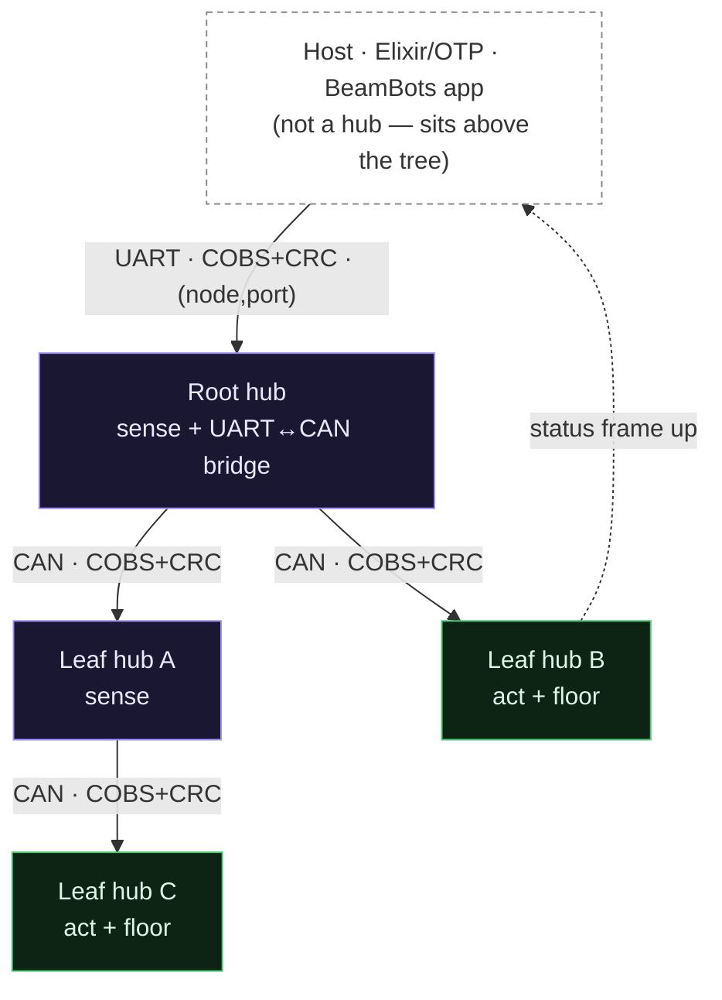
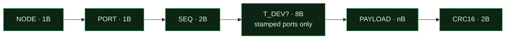
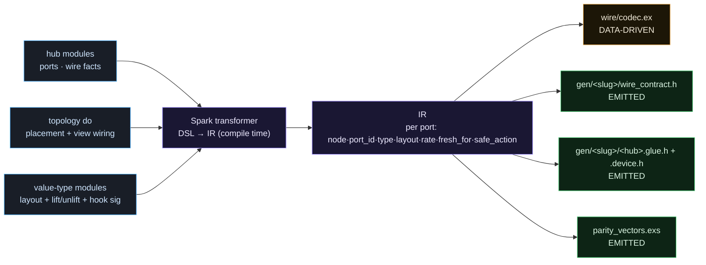
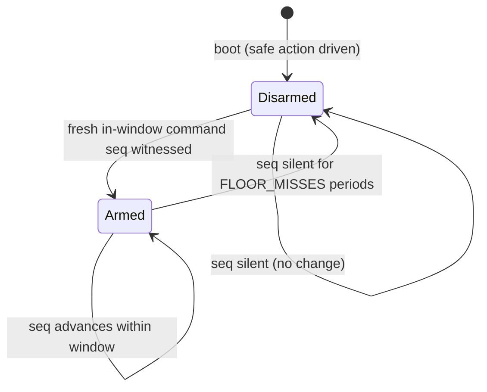
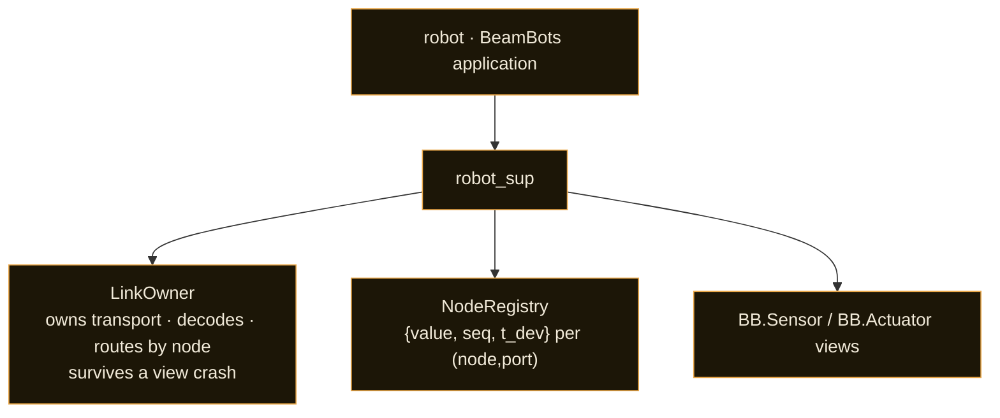
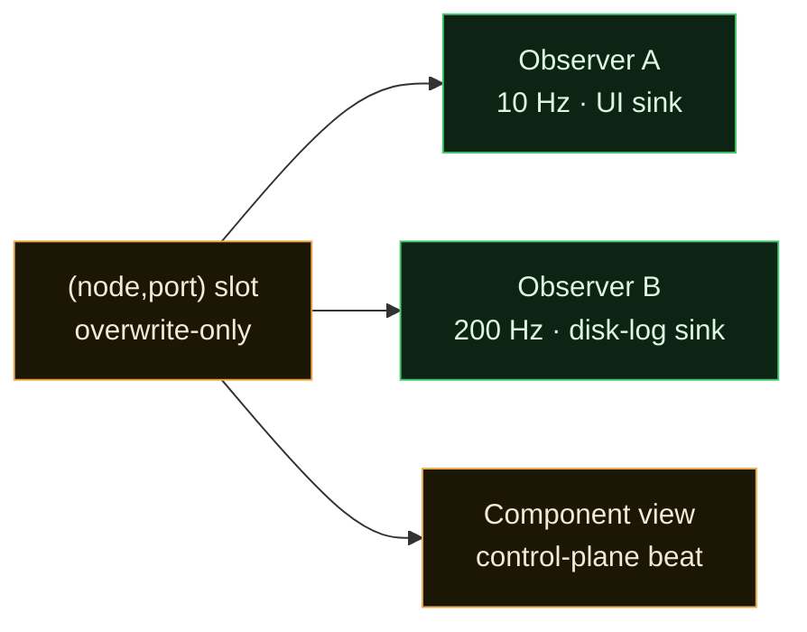
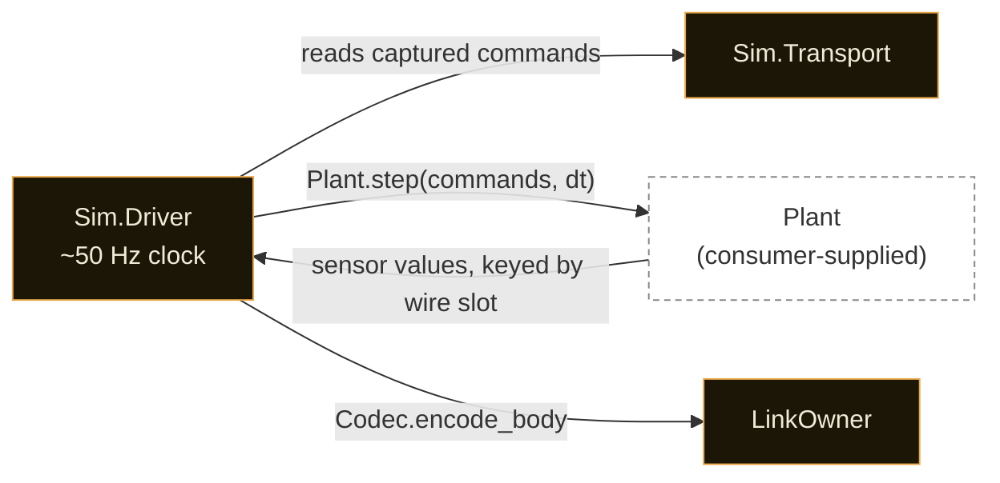
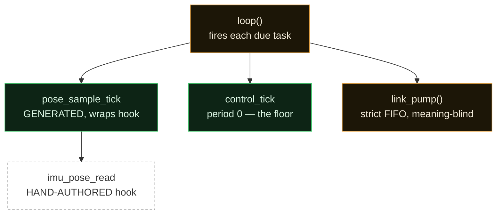
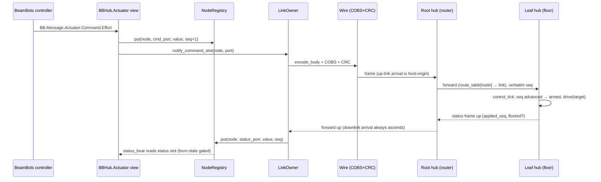

# bb_mcuhub — the hub gateway

## 00 Foundation

::: goal
**Compose, don't build**

A new robot is assembled from existing [hubs](CONTEXT.md#term-hub) through the
BeamBots topology and each hub's [contract](CONTEXT.md#term-contract). You write
core logic — a `sample` or a `step` — and the framework owns the plumbing.
:::

::: goal
**Declare, don't wire by hand**

You declare which hubs you want and how they connect. The framework owns the
non-declarative work — moving commands and readings, checking the link follows
through, deciding if a signal is fresh, surfacing an error.
:::

::: goal
**Fail into legibility**

A fault names itself — what broke, and where — and never collapses into
ambiguous silence.
:::

::: goal
**Safe in the gap**

The robot reaches a safe state on any fault, independently of the part that
failed, never depending on recovery succeeding.
:::

::: goal
**Reason locally**

You can understand and change one hub without holding the whole system in
your head.
:::

::: goal
**Test without hardware**

Core logic is pure and replayable: develop on a laptop, reproduce a run from
a log of values.
:::

::: goal
**Right-rate, not max-rate**

Move only the information that is needed, when it is needed. Never flood a
wire or a CPU.
:::

::: goal
**Evolve without rewrites**

Add a hub, move it to another node, or swap a control law by editing data,
not by rippling code.
:::

::: no-goal
**A hub↔hub mesh**

Every conversation on the wire is [host↔hub](CONTEXT.md#term-host-hub-conversations) — hubs never converse with each other. A reflex path between hubs is out of scope and would need its own deliberate design and authentication story.
:::

::: no-goal
**Clock-synchronized freshness**

Trust is a counter (`seq`), never a comparison between two boards' clocks — that reintroduces the shared-clock bug class the design exists to avoid.
:::

::: no-goal
**A closed value-type registry**

The library ships a lean stock set (imu, effort, status); a consumer always extends the wire vocabulary in their own project, never by forking the library.
:::

::: invariant {enforcement=convention lens=robustness}
**A value never crosses the wire without a seq**

A value re-presented as fresh though its `seq` never advanced is the failure
the counter exists to catch.
:::

::: invariant {enforcement=convention lens=composition}
**A forwarding hub never bumps a seq it is only relaying**

Only the producing hub advances its own `seq`; a [relay](CONTEXT.md#term-relay)
re-sends the same number, which no consumer trusts as new.
:::

::: invariant {enforcement=convention lens=state}
**Freshness is never measured by comparing two boards' clocks**

It is `seq`-advance within the reader's own `fresh_for` window — binary fresh
or stale, no clock sync.
:::

::: invariant {enforcement=mechanism script=firmware/src/floor.c lens=robustness}
**An actuator's safety never depends on a frame arriving**

The floor fires on command-`seq` silence; the broadcast e-stop is only a
faster way to cause that silence.
:::

::: invariant {enforcement=mechanism script=firmware/src/router.c lens=invariants}
**Two hubs never converse — every conversation is host↔hub**

The router makes this structural: a frame arriving on a downlink can only
ascend, so the host side is the sole origin of descending traffic — a child
cannot command its parent or a sibling
([ADR-0011](../adr/0011-router-is-direction-aware.md#adr-0011)).
:::

::: invariant {enforcement=mechanism script=firmware/src/floor.c lens=robustness}
**Every actuator boots disarmed; every reader boots stale**

A rebooted hub trusts nothing sitting in a buffer until it personally
witnesses a fresh write.
:::

::: invariant {enforcement=mechanism script=test/gen/wire_drift_test.exs lens=invariants}
**C and Elixir definitions share one generated contract**

If a header on disk differs from the contract, the build fails — they cannot
silently drift.
:::

::: invariant {enforcement=mechanism script=test/gen/wire_drift_test.exs lens=invariants}
**The CRC is a real, pinned CRC-16-CCITT**

A parity-vector fixture asserts the exact same bytes hash on both sides:
`crc("123456789") == 0x29B1`, or the build fails.
:::

::: invariant {enforcement=mechanism script=test/gen/wire_drift_test.exs lens=invariants}
**The CRC variant is pinned exactly**

CRC-16-CCITT-FALSE: poly `0x1021`, init `0xFFFF`, no reflection, xorout
`0x0000`. `check("123456789") == 0x29B1` on both codecs, asserted by the
[parity vectors](CONTEXT.md#term-parity-vectors) — the general CRC invariant
above, pinned to its exact parameters (§03).
:::

::: invariant {enforcement=mechanism script=firmware/src/floor.c lens=robustness}
**The floor fails closed on value width**

An over-wide command value (`n > FLOOR_MAX_VALUE`) is never copied into the
floor's buffers: `floor_init` clamps to drive nothing and stays disarmed,
`floor_on_command` ignores the command entirely — no `seq` update, so it
cannot count as an advance (§05).
:::

::: invariant {enforcement=mechanism script=lib/bb_mcuhub/host/registry lens=invariants}
**The link owner never writes a command slot**

Its `notify_command_slot` cast carries only `(node, port)`, never a value —
so it structurally cannot manufacture a `seq` advance (§06).
:::

::: invariant {enforcement=mechanism script=lib/bb_mcuhub/host/registry lens=robustness}
**An observer is a pure reader**

Handed a `Registry.Reader` capability with no `put` in scope — "an observer
writes a slot" is unrepresentable _through the capability_, not merely
forbidden (§08). The registry table is `:public` ETS for lock-free hot-path
writes, so a caller that bypasses the capability entirely (a raw `:ets`
call) is the one remaining, documented hole — see
[Slot](CONTEXT.md#term-slot).
:::

::: invariant {enforcement=convention lens=robustness}
**Every firmware tick is bounded**

A tick never spins or waits; device reads use a timeout. Cooperative
scheduling is safe only because one slow tick cannot indefinitely delay the
floor's next pass (§10).
:::

::: invariant {enforcement=convention lens=robustness}
**The watchdog guards the loop, not bring-up**

The task subscribes to the watchdog only after `hub_setup()` returns, so a
slow one-time device bring-up (a SimpleFOC `initFOC()` alignment, an i2c
settle) cannot boot-loop the chip (§10).
:::

::: principle {id=P1 lens=modeling}
**One shape, composed.**

A [hub](CONTEXT.md#term-hub) is the only MCU node type — it senses, actuates,
and routes to child hubs, in any combination. The [root hub](CONTEXT.md#term-root-hub)
is the one that declares `parent: :host`. Power comes from composing this one
shape into a tree, not from many special node kinds.
:::

::: principle {id=P2}
**Simple beats complete.**

v1 ships the smallest core that is still robust: a correct frame, a floor,
freshness, a contract. Deferred features are named, not hidden (see the
[deferred list](#10-firmware-the-per-port-scheduler)).
:::

::: principle {id=P3 lens=composition}
**The router is meaning-blind.**

When a hub forwards a frame for a child, it moves bytes and never parses the
payload. Only the producing hub and the final consumer read meaning.
:::

::: principle {id=P4 lens=state}
**A counter, not a clock.**

Freshness is "did [`seq`](CONTEXT.md#term-seq-t-dev) advance?" — answered in
the consumer's own beats, with no clock shared between boards.
:::

::: principle {id=P5 lens=robustness}
**Safe is the default; motion is earned.**

Nothing ever acts to become safe. An actuator hub drives to its
[safe action](CONTEXT.md#term-safe-action) the instant its command goes
silent, on its own chip — safe even if its parent, or the host, is entirely
gone.
:::

::: principle {id=P6}
**One source of truth for the wire.**

Frame layout, ids, and codecs are generated from one contract; a
[drift test](CONTEXT.md#term-drift-test) fails the build if the C side and the
Elixir side could disagree.
:::

::: principle {id=P7 lens=composition}
**A hub is pure core plus a thin shell.**

What a hub computes — a `sample` or a `step` — is a pure function testable on
a laptop. The framework owns the clock, the socket, and the routing.
:::

## 01 System at a glance

::: info {title="Reading the diagram"}
The host sits above the tree and reaches every node through one UART to the
root hub. Every link — UART or CAN — carries the same COBS+CRC frame, so a
leaf three hops away is reached exactly like the root; the hubs in between
are meaning-blind relays. Tinted boxes are in-domain (this design); white
dashed boxes are external actors.
:::

::: cards {cols=4 size=sm}

### Topology (§02)

The [hub](CONTEXT.md#term-hub) and the DSL that places it on a tree via
declared parent links.

### Wire (§03)

The frame, COBS framing, CRC-16, and CAN segmentation carrying values between
host and hub.

### Contract (§04)

The generated, drift-tested model that keeps the C and Elixir sides from
diverging.

### Freshness & the floor (§05)

The `seq`/`t_dev` discipline and the on-chip dead-man that make the system
safe.

### Host runtime (§06)

The OTP processes — registry, link owner, monitor — that hold the robot's
truth.

### The BeamBots seam (§07)

The thin `BB.Sensor`/`BB.Actuator` views that surface a hub port as a
component.

### Observability plane (§08)

Pure readers sampling slots at their own cadence, decoupled from the control
loop.

### Virtual robot (§09)

Running the real host stack against a physics plant instead of hardware.

### Firmware (§10)

The per-port cooperative scheduler and the hand-authored device hooks.
:::

## 02 The hub — topology & DSL

::: info {title="The five reproduction answers"}
**Responsibility** — provide the one node shape (sense/act/route) and the DSL
that declares a robot's hub tree, with the tree derived from parent pointers,
never inferred. **Interface** — `use BBMCUHub.Hub` (a hub module's `ports do`
block) and the `hubs do` / `topology do` sections composed onto `use BB,
extensions: [BBMCUHub.Dsl]`. **Interactions** — a compile-time Spark
transformer projects the assembled DSL into the [IR](CONTEXT.md#term-ir);
downstream (verifier, generator, host, codec) reads only the IR, never the
DSL. **Invariants** — exactly one root; every parent resolves; no cycles; node
ids unique; reserved ids unclaimed. **Failure behavior** — a malformed
topology is a compile-time `DslError` naming the offending pair; the bug
cannot ship.
:::

A [hub module](CONTEXT.md#term-hub-module) declares a device's intrinsic wire
facts — `dir`, value `type`, `rate`, `t_dev`, `safe_action` — independent of
deployment. The robot's `hubs do` block then _places_ that module on a node
id and declares its `parent:` + `uplink:`
([ADR-0006](../adr/0006-links-are-declared-not-inferred.md#adr-0006)); the
[root hub](CONTEXT.md#term-root-hub) is simply the one that declares
`parent: :host`. The tree falls out of these parent pointers — nothing about
shape or transport is inferred from node-id ordering.

::: cards {cols=3}

### hub.ex

**Declares a port's intrinsic wire facts.**

`BBMCUHub.Hub.Port` — one struct per port: `dir`, `type`, `rate`,
`has_safe_action`/`safe_action`, `t_dev`, and the declared `sample`/`step` MFA
refs (data only — the host never invokes them; they travel into the generated
firmware schedule).

### dsl.ex + dsl/

**Places hubs on the tree; projects the IR.**

`BBMCUHub.Dsl.Hub` (name, module, node, parent, uplink) lives in a `hubs do`
section our Spark extension adds beside BeamBots' own `topology do`. A
`Dsl.IrTransformer` walks both and persists the [IR](CONTEXT.md#term-ir) at
compile time; a Spark verifier ([Topology
validation](CONTEXT.md#term-topology-validation)) then checks the projected
model.

### Root hub

**The one hub that owns the host link.**

Declares `parent: :host`; speaks UART upward, bridges down to its children.
Exactly one per robot, checked at compile time. Still an ordinary hub — it
may sense or act while it bridges.
:::

A [Link](CONTEXT.md#term-link) is the edge between a hub and its parent — a
first-class entity, not a port. A parent may own any mix of downlinks (a CAN
bus and several UARTs); the generated route table maps each node to the
specific link that reaches it, but — per
[ADR-0011](../adr/0011-router-is-direction-aware.md#adr-0011) — that table
serves only descending frames (see [§03](#03-the-wire-frame-cobs-crc-segmentation)
for the routing rule itself).

::: info {title="Fixture instantiation"}
`test/support/fixtures/` is a coverage-maximizing fixture robot — it spans
both transports, stamped and unstamped ports, the actuator floor, and its own
custom value-type — so the library proves the wire and the extension seam in
isolation, with no downstream example required. It is the same DSL surface
described above, instantiated purely for test coverage.
:::

## 03 The wire — frame, COBS, CRC, segmentation

::: info {title="The five reproduction answers"}
**Responsibility** — carry a typed value between host and hub as a flat,
CRC-guarded byte frame, identical on UART and CAN. **Interface** — a value's
identity on the wire is `(NODE, PORT)`; `Wire.FramingCOBS` implements
`Circuits.UART.Framing` on the host side, `frame.c`/`cobs.c`/`crc16.c`/`segment.c`
on the firmware side. **Interactions** — the host's `LinkOwner` decodes inbound
frames and encodes outbound commands; a branch hub's router re-frames a body
between UART and CAN without touching NODE/SEQ/T_DEV/PAYLOAD. **Invariants** —
the CRC covers the whole body and is checked on both transports; a corrupt or
short frame is dropped and counted before any value is read; a frame never
exits the link it arrived on. **Failure behavior** — bad CRC, truncated COBS,
or CAN reassembly gaps all resolve to drop-and-count, never partial delivery.
:::

::: cards {cols=2 size=sm}

### The frame

The body — [`NODE · PORT · SEQ · [T_DEV] · PAYLOAD`](CONTEXT.md#term-the-frame)
— guarded by a real, pinned CRC-16/CCITT-FALSE. Present and verified on
**both** transports, so a re-framing bit-flip a hop's hardware CRC cannot
reach is still caught.

### COBS framing (UART)

`0x00`-delimited, COBS-encoded. `Wire.FramingCOBS` accumulates bytes, splits
on the delimiter, decodes, checks the CRC, and passes up only verified
bodies — nothing above the seam ever sees garbage.

### Segment (CAN)

A body wider than one CAN data field is
[segmented](CONTEXT.md#term-segment) into ordered fragments carried in the 13
reserved id bits, reassembled fail-closed before the CRC check. ≤ 64
fragments → a 512-byte body ceiling.

### Wire.Stats — the drop-and-count ledger

A lock-free `:counters` array (`BBMCUHub.Wire.Stats`) backing every "drop and
count" invariant on this page: `rx_drop`, `crc_fail`, `decode_fail`,
`cobs_truncated` on the inbound side, `encode_fail` on the one outbound
path (a command value that can't be packed to the wire is skipped, never
crashing the drain). `bump/1` needs no GenServer round-trip, so it is safe to
call from the framing layer's hot path.

### Routing — direction-first

[NODE](CONTEXT.md#term-node-port) names the hub end of a host↔hub
conversation. A frame from a **downlink** always ascends (link 0,
unconditional); only a frame from the **up-link** descends by
`route_table[node] → link`
([ADR-0011](../adr/0011-router-is-direction-aware.md#adr-0011)).
:::

The exact CRC parameters are pinned by an invariant in [§00](#00-foundation).

::: info {title="Why direction-first routing, not table-only"}
The wire's single NODE field names _the hub end of a conversation_ — the
destination going down, but the _source_ going up. Treating it as always a
destination (the pre-[ADR-0011](../adr/0011-router-is-direction-aware.md#adr-0011)
model) made a root reflect every leaf→host frame back down the link it
arrived on: telemetry never ascended, silently. Deciding by arrival link
first closes that gap structurally — see the [end-to-end
walkthrough](#11-end-to-end-walkthrough) for a full command/status round trip.
:::

## 04 The contract — generated, no drift

::: info {title="The five reproduction answers"}
**Responsibility** — be the single authored source of a hub's wire facts, and
guarantee the C and Elixir sides render the exact same bytes from it.
**Interface** — a [hub module](CONTEXT.md#term-hub-module)'s `ports do` block
plus a [value-type](CONTEXT.md#term-value-type) module's `layout`;
`BBMCUHub.Gen.WireGen.{emit_c_header/1,emit_glue/2,emit_device_header/2,emit_parity/1,emit_parity_c/1}`.
**Interactions** — the
Spark transformer projects the assembled DSL into the IR; the Elixir codec
reads the IR directly at runtime (data-driven, never emitted); the generator
renders three artifacts for the C side. **Invariants** — a
[drift test](CONTEXT.md#term-drift-test) fails the build if any emitted file
differs from what the model would emit now. **Failure behavior** — a
malformed contract (unresolved value-type, oversized body, `fresh_for` below
one period) is a compile-time `DslError`, not a runtime surprise.
:::

::: cards {cols=2}

### Value-type — the load-bearing idea

A standalone module (`use BBMCUHub.ValueType`) owning a `layout` (an ordered
`{field, wire_type}` list), a `lift`/`unlift` pair, and — for a command
value-type — the `command_message` it accepts. Names no node, pin, rate, or
bot, so it composes across hubs and robots. See
[Value-type](CONTEXT.md#term-value-type).

### The generator — three emitted artifacts

`wire_contract.h` (ids, structs, floor constants, contract hash), the
per-hub `<hub>.glue.h` + `<hub>.device.h` (router table, dispatch, floor
plumbing, schedule, hook prototypes), and the parity-vector fixture. The
Elixir codec is **not** emitted — it reads the IR directly.

### Topology validation (the verifier)

A Spark verifier over the projected IR: producer/reader reconciliation,
node-id uniqueness, reserved-id protection, `fresh_for` ≥ one period, and the
512-byte segmentation ceiling. See
[Topology validation](CONTEXT.md#term-topology-validation).

### The drift test

Re-runs the generator against the current IR and byte-compares the result
against the committed generated files. A hand-edit or a stale checkout fails
the build. See [Drift test](CONTEXT.md#term-drift-test).
:::

::: info {title="Generated vs. described, not duplicated"}
`firmware/gen/robot/` (the library's fixture robot's generated artifacts) and
the per-app `firmware/gen/<slug>/` trees are drift-tested output of this
section's generator — this design describes the generator and its contract,
not the generated bytes themselves.
:::

::: warning {title="Node identity is trust-on-first-use"}
The compile-time checks verify the _static_, declared topology — they do not
verify, on the live bus, that the board answering as a given NODE is the one
you flashed. A mis-flashed or swapped board silently writes another hub's
slot until the deferred `fw_id` check lands (see [§10](#10-firmware-the-per-port-scheduler)'s
deferred list). A confused board still cannot _arm_ without a fresh in-window
command its own floor witnessed.
:::

## 05 Freshness & the floor — safety

::: info {title="The five reproduction answers"}
**Responsibility** — make "is this value still flowing?" and "is this
actuator safe?" answerable without a shared clock or a live connection.
**Interface** — `seq`/`t_dev` on every stamped frame; the on-chip floor's
compiled-in window (`FLOOR_MISSES × CMD_PERIOD_MS`); the host
`Monitor.check/1` (whole-registry sweep) and `Monitor.check_row/2` (one
`(node, port)`). **Interactions** — a producer bumps its own `seq` on every
real write; a relay copies it verbatim, in arrival order; a consumer's
monitor compares against its last-seen `seq`; the floor watches its own
command `seq` independent of any host process. **Invariants** — `seq` is the
only stamp in the trust path; a relay never mints a `seq`; every actuator
boots disarmed. **Failure behavior** — silence (no `seq` advance) is _the_
failure mode, and it degrades to the safe action locally, on-chip, without
needing to distinguish _why_ the silence happened.
:::

::: cards {cols=2}

### seq — is it still flowing?

A per-write counter the producer bumps by one on every real new value. Advance
is the plain inequality `seq != last_seq` — sound only because every path is
in-order (point-to-point UART/CAN, and a [relay](CONTEXT.md#term-relay) that
is a strict FIFO byte pump). See [seq · t_dev](CONTEXT.md#term-seq-t-dev),
[Advance](CONTEXT.md#term-advance).

### t_dev — same-device only

The producer's own monotonic microseconds at the write. Never compared
across nodes, never read by the freshness check — a passenger for
same-device alignment, jitter, and replay. Opt-in per port (8 bytes is the
largest field).

### fresh_for · born-stale

Each consumer declares `fresh_for` as a multiple of the producer's nominal
period. A freshly booted consumer is born stale: the first observed `seq` is
only a baseline, and trust begins on the first _change_ from it — a leftover
value is never trusted.

### The floor — the guarantee

Watches its own command `seq` on its own clock; on silence it drives to the
[safe action](CONTEXT.md#term-safe-action) and latches disarmed. Fires even if
the parent, the tree above, or the host is entirely gone
([ADR-0005](../adr/0005-safe-action-is-a-value-type-value.md#adr-0005)).
:::

The floor's fail-closed-on-value-width behavior is pinned by an invariant in
[§00](#00-foundation).

The [e-stop](CONTEXT.md#term-e-stop) — heartbeat and broadcast disarm — is an
_accelerator_, not a second mechanism: both resolve to the same thing at the
actuator, its command `seq` going silent, so there is no second "react to the
stop frame" path that could itself fail.

::: warning {title="A control loop must gate its own output on disarm"}
The floor's safe state is reached by command-silence, which assumes the host
_stops commanding_ on disarm. A control loop is an always-commanding actor —
it never goes silent on its own and would re-advance the floor's `seq` every
tick, defeating disarm. A host control loop must therefore subscribe to
safety-state transitions and publish nothing while not armed
([ADR-0010](../adr/0010-a-control-loop-falls-silent-on-disarm.md#adr-0010)).
See [A control loop falls silent on disarm](CONTEXT.md#term-control-loop-falls-silent).
:::

An actuator hub also reports its own truth upward — the
[Status slot](CONTEXT.md#term-status-slot) (`{applied_seq, floored?}`), gated
by the same born-stale check, so the host never shows a confident "driving"
while a wheel sits floored.

## 06 Host runtime

::: info {title="The five reproduction answers"}
**Responsibility** — hold the robot's truth in a small per-`(node, port)`
registry, own the one UART to the root hub, and drive commands/readings
between the wire and the BeamBots seam. **Interface** — `BBMCUHub.Host`
(the generic launcher, taking `robot:`), `Host.Transport` (the behaviour
UART/loopback/sim all implement), `NodeRegistry.{get,put}`,
`LinkOwner.notify_command_slot/2`. **Interactions** — inbound: `LinkOwner`
decodes a verified body and writes the registry; outbound: an actuator view
writes its command slot and casts a notify, `LinkOwner` drains that one slot
event-driven (no poll). **Invariants** — the registry write is one atomic row
(never a torn stamp); exactly one writer per slot, enforced by a
`Registry.Writer` capability. **Failure behavior** — a bad/short frame is
counted (`decode_fail`) and dropped; a command that can't be packed to the
wire is counted (`encode_fail`) and skipped, never crashing the drain.
:::

::: cards {cols=2}

### host.ex

**The generic launcher.** `use BBMCUHub.Host` takes `robot:`, derives the
command slots to watch from the robot's IR, and wires the `BB.Supervisor` +
`LinkOwner` — absorbing the supervisor a consumer would otherwise hand-write.

### host/link_owner.ex

**Owns the transport; the one decode + route seam.** Meaning-aware only at
the host's own ports. A read-only drain of command slots — never their
writer — so it can never manufacture a `seq` advance. See
[LinkOwner](CONTEXT.md#term-link-owner).

### host/node_registry.ex

**The host's small truth.** One row per `(node, port)`: `{value, seq,
t_dev}`. `get` is one lookup; `put` is one atomic write of the whole row. See
[Slot](CONTEXT.md#term-slot). A `Registry.Writer` mint for a slot whose
prior writer process died (a view crash, a supervisor restart) resolves the
race by liveness — the registry checks `Process.alive?/1` on the recorded
writer and demonitors/replaces it rather than raising `Writer.Taken` against
a writer that can no longer write.

### host/monitor.ex

**The freshness check.** One comparison per port per beat: did `seq` advance
within `fresh_for`? Born stale until the first witnessed change from the
baseline.

### host/registry/ (reader + writer)

**The capability split.** `Registry.Reader` (`get`/`dump`, no `put` —
handed to observers) and `Registry.Writer` (slot-scoped, minted once per
slot; a second mint raises `Writer.Taken`) — the structural enforcement of
one-writer-per-slot
([ADR-0007](../adr/0007-one-writer-per-slot-is-a-capability.md#adr-0007)).

### host/transport/ (uart · loopback)

**The hardware boundary.** `Host.Transport` is the behaviour; UART is
production, loopback is in-process test. A third implementation — the sim
transport — is described in [§09](#09-the-virtual-robot-sim).
:::

The link owner's inability to write a command slot is pinned by an invariant in [§00](#00-foundation).

## 07 The BeamBots seam — control plane

::: info {title="The five reproduction answers"}
**Responsibility** — surface a hub port as an ordinary `BB.Sensor` /
`BB.Actuator` component, so BeamBots sees components and never the wire below
them. **Interface** — `BBHub.Sensor` / `BBHub.Actuator` (`use BB.Sensor` /
`use BB.Actuator` callback modules with `options_schema:` naming `hub:` +
`port:`). **Interactions** — a sensor view reads its slot on its own beat,
checks born-stale freshness, and `BB.publish`es a lifted `BB.Message`; an
actuator view's server auto-subscribes the command topic named by the
value-type's `command_message` and writes its one command slot on receipt.
**Invariants** — a sensor view is value-type-agnostic (delegates
`lift`/`unlift`); an actuator view is the single writer of its command slot.
**Failure behavior** — a sensor stops publishing when stale (never fabricates
a value); `disarm/1` is best-effort intent, never the safety mechanism
itself — that is the floor's.
:::

::: cards {cols=2}

### bb_hub/sensor.ex

**Slot → BB.Message, born-stale gated.** A beat loop and almost nothing
else: pull the row, ask the monitor "did `seq` advance?", lift a _fresh_
value onto BeamBots' PubSub under the component's path. Publishes nothing
while stale.

### bb_hub/actuator.ex

**BB.Message → slot, sole writer.** Mints a slot-scoped `Registry.Writer` at
init (a second view on the same slot fails loud, `Writer.Taken`). Decodes
each command, writes the slot, advances the command `seq`. Reads liveness
from the [Status slot](CONTEXT.md#term-status-slot) through its own
born-stale monitor.
:::

Neither view opens a socket, frames a byte, or names UART vs. CAN — both run
unchanged whether the port sits on the root hub's own I²C or a CAN leaf three
hops down. See [Component](CONTEXT.md#term-component).

## 08 The observability plane

::: info {title="The five reproduction answers"}
**Responsibility** — let any number of independent consumers watch the
robot's slots at their own cadence, structurally unable to slow the control
plane. **Interface** — `BBMCUHub.Observer` (imperative start; a declarative
`observers do` is later sugar); `observer/sample.ex`, `observer/sink.ex`.
**Interactions** — an observer polls a slot directly via a read-only
`Registry.Reader`, reduces along the sample/select axes, and hands the result
to a pluggable sink. **Invariants** — an observer never writes a slot
(unrepresentable — the capability has no `put`); nothing in the control plane
may depend on an observer existing. **Failure behavior** — a slow sink
degrades only that observer's own process, never the loop or any other
observer.
:::

::: cards {cols=2 size=sm}

### sample-state (level) — v1

A pure registry poll: read the latest value on your own timer; dropping
skipped values between polls is correct. For "what is it now?" — a UI
monitor.

### stream-events (edge) — deferred

Must catch every advance, which a poller cannot — it would instead tap the
`LinkOwner`'s unconditional decode fan-out. For "what happened?" — an event
log. **SAFeD; not built.**

### Four reduction axes

**sample** (rate decimation) and **select** (which slots) ship in v1;
**filter** (value predicate) and **project** (field selection) are named
extensions of the same shape, not yet built.

### Not part of the wire contract

Pure host runtime — no firmware, no generated artifact, drift-neutral. Added
or removed without regenerating anything.
:::

An observer's pure-reader property is pinned by an invariant in
[§00](#00-foundation).

The plane is generic and dep-agnostic — it serves any sink. Wiring a specific
dashboard onto it (e.g. `bb_tui` reading an observer's slow republish topic
instead of the broad `[:sensor]` firehose) is a **consumer use case**,
demonstrated in [`segby_v1`](../design/segby-v1/design.md), not something the
observer design bends around
([ADR-0004](../adr/0004-observer-plane.md#adr-0004)).

## 09 The virtual robot — sim

::: info {title="The five reproduction answers"}
**Responsibility** — run the real host stack with no hardware by swapping
only the transport, the one thing that _is_ the hardware boundary.
**Interface** — `BBMCUHub.Sim.Transport` (a third `Host.Transport`),
`BBMCUHub.Sim.Plant` (a behaviour a consumer implements), `BBMCUHub.Sim.Driver`
(the real-time loop). **Interactions** — the transport captures each outbound
command per slot on `send/2`; the driver, on its own ~50 Hz clock, calls
`Plant.step`, and injects the returned sensor values as wire bodies exactly as
a UART decode would. **Invariants** — everything above the transport (codec,
freshness, the floor's meaning, the views) is the unchanged real stack, and
cannot tell the robot is virtual. **Failure behavior** — a plant crash
restarts the driver loop without tearing down the link (the loop lives in the
driver, not the transport).
:::

::: cards {cols=3 size=sm}

### Sim transport

A pure capture, no clock: on each outbound `send/2` it records the newest
command per `(node, port)` slot.

### Plant (consumer-supplied)

Given the latest per-slot commands and a `dt`, advances a simulated world and
returns sensor values keyed by wire slot — never robot structs, the same
byte-/value-generic stance as a safe action.

### Driver

The engine-agnostic real-time loop: owns the clock, calls `Plant.step`,
injects sensors so the sensor views witness a genuine `seq` advance and
born-stale is honored unchanged.
:::

The library ships all three pieces engine-agnostic; a consumer writes the
plant (`segby_v1`'s is a MuJoCo plant over a `Port` — see
[its design](segby-v1/design.md), §05).
See [Virtual robot](CONTEXT.md#term-virtual-robot)
([ADR-0008](../adr/0008-virtual-robot-sim-in-the-loop.md#adr-0008)).

::: info {title="Distinct from the test-only VirtualHub"}
`test/support/virtual_hub.ex` (`BBMCUHub.Test.VirtualHub`) shares the
philosophy "simulate at the transport" but is a different seam: a
deterministic, frozen-clock, real-C-floor _assertion_ tool for e2e tests
(`tick(vhub, now_ms)` is its only clock — no wall-clock sleeps), backed by a
test-only NIF (`test/support/c_src/`) wrapping the actual `firmware/src/*.c`.
The virtual robot above is the interactive, real-clock, physics-backed _dev_
seam. Use the VirtualHub for host↔hub resilience/safety/wire test coverage —
it exercises the real safety code, so it can't drift from the device the way
an Elixir mock would.
:::

## 10 Firmware — the per-port scheduler

::: info {title="The five reproduction answers"}
**Responsibility** — drive every port's own rate from one cooperative loop,
with the schedule generated from the contract so a port's declared rate and
its firmware period can never disagree. **Interface** — a `{period_us, tick}`
row per port in the generated `hub_tasks[]`; the hand-authored
[firmware hook](CONTEXT.md#term-firmware-hook) (`<hub>_device_setup()`,
`<hub>_<port>_read`/`_drive`). **Interactions** — the loop fires each due
row; a generated tick wraps the user's hook, calls the pure `sample`, writes
the frame, and advances `seq`; `link_pump()` moves frames between links in
arrival order. **Invariants** — `control_tick` has period 0
(never starved by telemetry); every tick is bounded (no spin/blocking).
**Failure behavior** — a tick that can't complete returns and writes
nothing (its `seq` stalls, the reader goes stale — legible, not a hang); a
hardware watchdog (armed only _after_ device setup) resets the chip if a tick
wedges the loop, and the actuator comes up born-disarmed.
:::

::: cards {cols=2}

### firmware/src/esp32/ (scheduler, router, hub_main.cpp)

The ESP32 runner: `scheduler.c` fires due `hub_tasks[]` rows; `router.c`
implements the direction-first rule ([§03](#03-the-wire-frame-cobs-crc-segmentation));
`hub_main.cpp` is the entry point.
:::

The bounded-tick and watchdog-after-setup rules are pinned by two invariants in [§00](#00-foundation).

::: cards {tint=amber}

### Deferred — named, not forgotten (SAFeD)

Roughly build-order: arm-nonce handshake · `fw_id`/board-identity check ·
conflation/backpressure · per-register param validation + EEPROM/SRAM split ·
wire-budget & full declare/pick/validate · host coordination policy ·
registerable `HubDevice` vtable (Shape 2, runtime device-swap) · health fold
across scopes / self-heal / A-B firmware. Each is a strict _addition_ of a
guard — none changes a v1 default away from safe. See
[SAFeD](CONTEXT.md#term-safed).
:::

## 11 End-to-end walkthrough

A teleop command reaches a motor, gated by the floor, and status flows back —
touching topology, the wire, the contract, the host runtime, the BeamBots
seam, and firmware.

::: info {title="Where each invariant fires"}
The command never risks a stale re-send: the actuator view is the _sole_
writer of its command slot, so `seq` advances only on a genuine new command.
The router's direction-first rule
([ADR-0011](../adr/0011-router-is-direction-aware.md#adr-0011)) means the
status frame ascends unconditionally the moment it arrives on a downlink — no
table lookup, no risk of reflection back down. If the command stream ever
stalls anywhere upstream of the leaf, the leaf's own floor notices the `seq`
silence independently and drives the [safe action](CONTEXT.md#term-safe-action)
— the round trip shown here is entirely best-effort on top of that
guarantee, never the guarantee itself.
:::
