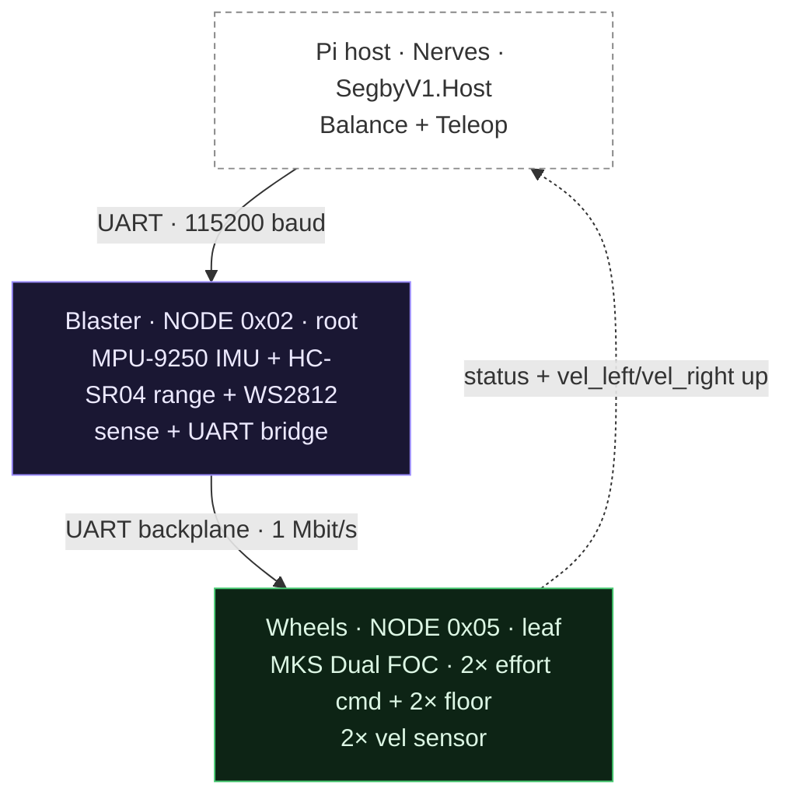
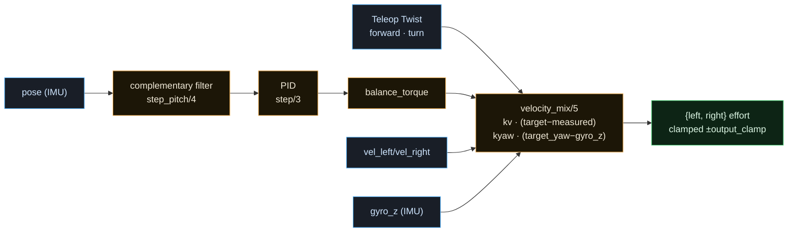
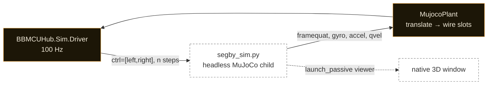
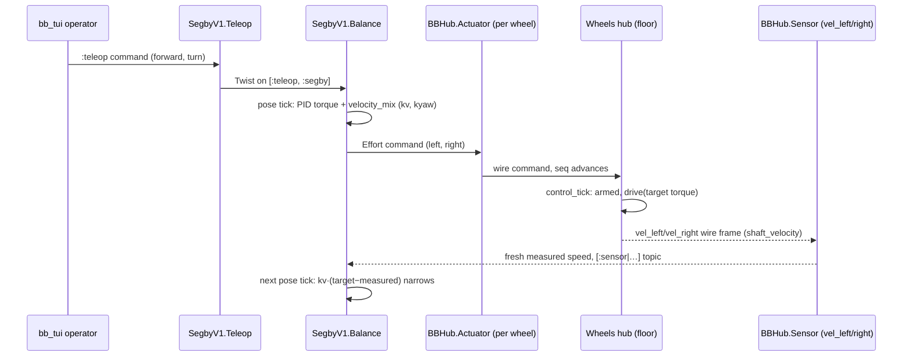

# segby_v1 — a worked bb_mcuhub consumer

## 00 Foundation

::: goal
**Run virtually with zero hardware setup**

The whole control stack — balance, teleop, the wire path, the floor — runs
against a MuJoCo physics model with no board powered, no chassis assembled,
so control logic (gains, teleop mixing, the pitch→wheel sign) is developed
and de-risked before the bench.
:::

::: goal
**Prove the library's extension seams by construction**

Every consumer-facing seam `bb_mcuhub` claims to offer — a custom value-type,
a custom hub, the generic host launcher, the sim `Plant` behaviour — is
exercised here rather than merely stubbed, so a broken seam breaks this
example's build.
:::

::: goal
**Deploy to a moving robot with no manual device wiring**

From a fresh Nerves image to a balancing bot needs no hand-edited
udev/systemd/network config beyond the documented wifi env vars — `mix
firmware` + `mix firmware.burn` produces a bot that boots the host, opens the
UART, and serves its own dashboard over SSH.
:::

::: no-goal
**A general-purpose robot framework**

`segby_v1` is one worked example, not a second library — anything reusable
belongs in `bb_mcuhub` (see
[ADR-0003](../../adr/0003-library-example-split.md#adr-0003)), and this
context never grows its own extension points that duplicate the library's.
:::

::: no-goal
**Bench-accurate simulation**

The MuJoCo plant narrows the sim-to-real gap for control-logic development;
it does not replace the bench's silicon truths (motor/encoder sign, pin map,
FOC alignment) and never claims to.
:::

::: invariant {enforcement=convention lens=robustness}
**The balance controller never commands through disarm**

`SegbyV1.Balance` subscribes to safety-state transitions and publishes
nothing while not armed, seeding armed-ness from `BB.Safety.state` at boot
([ADR-0010](../../adr/0010-a-control-loop-falls-silent-on-disarm.md#adr-0010)).
This is the general rule from [the root design](../design.md) (§05, Freshness
& the floor) applied to a concrete always-commanding loop.
:::

::: invariant {enforcement=convention lens=state}
**Turn closes on measured yaw, never open-loop differential**

The differential wheel torque that produces a turn is driven by
`kyaw · (target_yaw_rate − gyro_z)`, the IMU's measured body-Z rate — never
an open-loop differential of wheel-speed targets, which has no feedback and
can pump enough yaw-coupled energy to topple the pitch-only balance PID.
:::

::: invariant {enforcement=convention lens=state}
**Both control terms are additive, never a balance sign override**

`kv · (target − measured)` (forward) and `± kyaw · (target_yaw_rate −
gyro_z)` (turn differential) are added onto the balance PID's output; neither
term ever changes the balance sign or bypasses the pitch loop (§03).
:::

::: principle {id=SP1}
**A consumer touches the library only at its seams.**

`SegbyV1.*` never lives inside `BBMCUHub.*`'s namespace and never edits
library source; every device-specific decision is expressed through
`BBMCUHub.Hub`, `BBMCUHub.ValueType`, `BBMCUHub.Dsl`, `BBMCUHub.Host`, or
`BBMCUHub.Sim.Plant`.
:::

::: principle {id=SP2 lens=robustness}
**Torque stays torque; control laws ride on top.**

The wheel command is always effort/torque, faithful to the real MKS Dual FOC
hardware. Speed and yaw-rate control are host-side laws layered above it, so
the sim and the hardware run the identical plant interface.
:::

## 01 System at a glance

::: info {title="Reading the diagram"}
Two hubs on a UART backplane (no CAN transceiver on hand): the Blaster root
senses pose + range and bridges to the Wheels leaf, which drives both motors
behind two independent on-chip floors. The host runs two control loops on
top — balance (always-on, pitch→torque) and teleop (operator intent →
balance's velocity/yaw-rate targets).
:::

::: cards {cols=4 size=sm}

### Topology (§02)

`SegbyV1.Robot` places the Blaster + Wheels hubs and wires their ports to
BeamBots components.

### Balance & teleop (§03)

The always-on pitch PID and the operator-driven velocity/yaw-rate targets
layered on top of it.

### Wheel-speed & velocity loop (§04)

The context-owned sensor port and the inner control law it closes.

### Virtual robot (§05)

The MuJoCo plant that runs the whole stack with no hardware.

### Deployment (§06)

Nerves provisioning for the physical Pi host, and the sim's own zero-hardware
path.

### Firmware hooks (§07)

The hand-authored device-specific reads/drives under `firmware/mcu/`.
:::

## 02 Topology instantiation

::: info {title="The five reproduction answers"}
**Responsibility** — instantiate the library's hub/DSL surface for this one
robot's actual sensors and actuators. **Interface** — `SegbyV1.Robot` (`use
BB, extensions: [BBMCUHub.Dsl]`), `SegbyV1.Hubs.{Blaster,Wheels}` (`use
BBMCUHub.Hub`), `SegbyV1.ValueTypes.{Range,Led,WheelSpeed}` (`use
BBMCUHub.ValueType`). **Interactions** — the `hubs do` block places Blaster
(root) and Wheels (leaf, `parent: :blaster, uplink: :uart`); `topology do`
wires each port to a `BBMCUHub.BBHub.Sensor`/`Actuator` view.
**Invariants** — every value-type used here is either a library stock type
or defined in this app's own namespace, never inside `BBMCUHub.*`.
**Failure behavior** — identical to the root design's [topology
validation](../CONTEXT.md#term-topology-validation): a malformed placement
is a compile-time `DslError`.
:::

::: cards {cols=3}

### SegbyV1.Hubs.Blaster (root, NODE 0x02)

**Owns the host UART; senses pose + range; drives status LED.** `parent:
:host`. Ports: `pose` (`:imu`, 100 Hz, stamped), `range_front` (`Range`, a
consumer value-type, 20 Hz), `status_led` (`Led`, a consumer value-type,
20 Hz, non-floored).

### SegbyV1.Hubs.Wheels (leaf, NODE 0x05)

**One MKS Dual FOC board, two independent floors.** `parent: :blaster,
uplink: :uart`. Ports: `motor_left`/`motor_right` (`:effort`, 50 Hz,
`has_safe_action: true, safe_action: %{nm: 0.0}`), `status_left`/`status_right`
(`:status`, 50 Hz), `vel_left`/`vel_right` (`WheelSpeed`, 50 Hz — see
[§04](#04-wheel-speed-sensor-host-velocity-loop)).

### Own value-types — the extension seam proven

`SegbyV1.ValueTypes.{Range,Led,WheelSpeed}` are consumer-defined
(`use BBMCUHub.ValueType`) rather than relying on the stock set — the
worked proof that a consumer extends the wire vocabulary with no library
edit. See [Value-type](../CONTEXT.md#term-value-type).
:::

`SegbyV1.Robot`'s `topology do` block places the sensor/actuator views:
`chassis_imu` and `range_front` read the Blaster; `vel_left`/`vel_right` read
the Wheels' sensor ports on the same `[:sensor | …]` topic pose uses;
`left_drive`/`right_drive` are `BBMCUHub.BBHub.Actuator` views over
`motor_left`/`motor_right`, each naming its own `status_port` for liveness.
`SegbyV1.Host` is a thin wrapper over the library's generic
`BBMCUHub.Host` launcher — it supplies no supervision logic of its own.

## 03 Balance & teleop

::: info {title="The five reproduction answers"}
**Responsibility** — hold the bot upright (balance) and translate operator
intent into bounded per-wheel targets (teleop), entirely on the host, as pure
control laws over the BeamBots seam. **Interface** — `SegbyV1.Balance` (a
`BB.Controller`: `pose_topic`, `left_actuator_path`, `right_actuator_path`,
PID + velocity-loop gains); `SegbyV1.Teleop` (a `BB.Command` publishing a
`BB.Message.Geometry.Twist` onto `[:teleop, :segby]`). **Interactions** —
balance subscribes to the chassis IMU pose and both wheel velocity sensors,
consumes teleop's Twist as `forward`/`turn` targets, and publishes
`BB.Message.Actuator.Command.Effort` to both wheel actuator topics every pose
tick; it never writes a hub command slot directly — that stays the actuator
view's job. **Invariants** — balance gates on the safety state
([ADR-0010](../../adr/0010-a-control-loop-falls-silent-on-disarm.md#adr-0010));
starts disabled. **Failure behavior** — a stale pose (`:pose in stale`)
returns `{:no_command, law}`, so the wheel's own floor takes over exactly as
the root design's freshness discipline prescribes.
:::

::: cards {cols=2}

### Balance — always-commanding, pitch-only PID

A complementary-filter pitch estimate (`step_pitch/4`, blend factor
`α = 0.98`, gyro-heavy short-term / accel-anchored long-term) feeds a PID
producing a balance torque every pose tick. Tuned defaults: `kp: 0.5, ki:
0.05, kd: 0.1` (balance PID), `kv: 0.02` (inner velocity loop), `kyaw: 0.012`
(yaw-rate loop, bounded so `kyaw · max_yaw_rate` — `max_yaw_rate` defaults to
`0.5` rad/s — stays small relative to the balance PID's authority, keeping a
sustained hard turn from toppling the pitch loop). With zero teleop the
velocity/yaw-rate targets are both zero, so the loop actively holds the
wheels at zero speed and zero yaw — resisting drift, not merely idling. An
alternate pitch estimator, `pitch_from_imu/1` (quaternion-based), is kept as
an unused helper alongside the complementary filter — not dead code to
remove, a documented alternative the module keeps for reference.

### Enable / disable — live, not boot-time

Balance starts **disabled** (`enabled: false` by default — a fresh boot is
not actively held upright). It is armed live via `enable/1`/`disable/1`
(`{:balance_enable, bool}`). The **inner velocity loop keeps running while
balance is disabled**: with no balance torque, `kv`/`kyaw` still close on
teleop targets, so a disabled robot can still be driven (just not
self-balanced) — this is a deliberate bring-up affordance, not an oversight.

### Teleop — the bridge from bb_tui to balance

`bb_tui` has no built-in teleop concept, so operator drive is a declared
`:teleop` command (`forward`/`turn` floats, each clamped to `[-1.0, 1.0]`)
publishing onto balance's teleop topic — never writing the wheel actuators
directly, which would fight balance for single-writer status.
:::

The additive-terms rule is pinned by an invariant in [§00](#00-foundation).

## 04 Wheel-speed sensor · host velocity loop

::: info {title="The five reproduction answers"}
**Responsibility** — report each wheel's measured angular velocity so the
host can close a speed loop instead of commanding an unbounded torque bias.
**Interface** — the [Wheel-speed sensor · host velocity
loop](CONTEXT.md#term-wheel-speed-sensor) term; `WheelSpeed` (one `:f32`
rad/s, `dir: :out`), ports `vel_left`/`vel_right` on the Wheels hub.
**Interactions** — firmware sources it from SimpleFOC's closed-loop
`shaft_velocity`; the sim plant sources it from MuJoCo's `qvel`; both surface
through the same `BBMCUHub.BBHub.Sensor` view + `[:sensor | …]` topic the IMU
pose uses, so `SegbyV1.Balance` subscribes to it exactly like pose.
**Invariants** — this is a measurement, categorically distinct from the
[Status slot](../CONTEXT.md#term-status-slot)'s liveness bit; it is never
inferred from "we sent a command." **Failure behavior** — same as any sensor
port: stale readings simply stop publishing, and the balance loop's own
staleness handling (§03) takes over.
:::

::: info {title="Why this exists — the ADR-0009 story"}
Driving the balancing bot with a raw torque bias was unusable: on a
balancer, torque is acceleration, so any non-trivial forward command ran the
wheels away and toppled the bot — only `forward ≈ 0.001` was usable. Every
wheeled balancer solves this by commanding **speed**, and the real MKS Dual
FOC motors already run SimpleFOC closed-loop velocity mode — the information
simply never reached the host. `WheelSpeed` closes that read seam
([ADR-0009](../../adr/0009-wheel-velocity-sensor-and-host-velocity-loop.md#adr-0009))
without changing the wheel command type (still torque, faithful to the real
FOC) and without conflating liveness (`:status`) with measurement.
:::

The turn amendment (documented in `design_changelog.md`, 2026-06-25) applies
the same "close the loop on a measurement" logic to yaw: `turn` was
originally an open-loop differential of the two wheel-speed targets, which
had no feedback on the actual chassis yaw and could pump enough energy to
topple the pitch-only balancer on a sustained hard turn. Reading the IMU's
already-on-the-wire `gyro_z` and closing `kyaw · (target_yaw_rate − gyro_z)`
on it made a sustained turn self-limiting — this is why §03's diagram shows
`gyro_z` feeding `velocity_mix/5` alongside the two measured wheel speeds.

::: cards {tint=amber}

### Scope: segby_v1 only

Unlike ADR-0005 through ADR-0008, this touches no `lib/bb_mcuhub` — `WheelSpeed`
is a consumer value-type on the stock `BBMCUHub.ValueType` behaviour,
`vel_left`/`vel_right` use the stock port DSL. It exercises the library's
extensibility; it does not change the library.
:::

## 05 The virtual robot in this example

::: info {title="The five reproduction answers"}
**Responsibility** — supply the consumer-side dynamics for the library's
engine-agnostic sim seam, so the whole segby_v1 control stack runs against
faithful physics with zero hardware. **Interface**
— `SegbyV1.Sim.MujocoPlant` (`@behaviour BBMCUHub.Sim.Plant`), a
line-JSON `Port` protocol to `sim/segby_sim.py`, `sim/segby.xml` (the
hand-authored MJCF). **Interactions** — the plant translates each wheel
effort command into MuJoCo's `data.ctrl` (index-ordered to match the MJCF
actuators) and translates MuJoCo's IMU site sensors + wheel hinge `qvel`
back into the `pose`/`vel_left`/`vel_right` wire values;
`mix segby.sim` wires `BBMCUHub.Sim.{Transport,Driver}` to this plant at
100 Hz (matching the pose port's rate) and opens a native 3D viewer beside
the terminal `bb_tui`. **Invariants** — the actuator index order in the
plant code must match `sim/segby.xml`'s actuator order exactly (documented
as a load-bearing convention, not enforced by a compile-time check).
**Failure behavior** — a fake `Child` implementation
(`SegbyV1.Sim.MujocoPlant.Child` behaviour: `open/1`, `send_line/2`,
`recv_line/1`, `close/1`) lets the plant's command-mapping and sensor-parsing
be unit-tested with no MuJoCo process and no real `Port`.
:::

::: cards {cols=2 size=sm}

### The Port wire — command-driven JSON-per-line

One `{"op":"set_ctrl_and_step","ctrl":[l,r],"n":N}` line out per driver tick;
one `{"event":"state", sensordata, qpos, qvel, framequat, gyro, acc}` line
back. `n` is derived from the driver's `dt_s` and the MJCF timestep so one
host tick always advances the same simulated time.

### Zero-hardware, by construction

No chassis, no board, no motor needs to exist: `mix segby.sim` from
`examples/segby_v1` brings up the real `SegbyV1.Host` stack with the sim
transport injected, already armed and balancing, teleop-able from the same
terminal's `bb_tui`.
:::

This is the segby-specific half of
[the root design's virtual-robot seam](../design.md) (§09, The virtual robot)
([ADR-0008](../../adr/0008-virtual-robot-sim-in-the-loop.md#adr-0008)); the
library ships the transport/driver/behaviour, this context ships the only
consumer-supplied piece, the plant.

## 06 Zero-touch deployment — sim and Nerves

::: info {title="The five reproduction answers"}
**Responsibility** — get from source to a running robot two ways — a
simulated one with no hardware at all, and a physical one from a single
`mix firmware` build — with no manual per-device configuration beyond wifi
credentials. **Interface** — `nerves_host/` (its own Mix app,
`:segby_v1_nerves`, depending on `:segby_v1` — never the reverse);
`sim/pyproject.toml` + `uv sync`. **Interactions** — `nerves_host`'s
`SegbyV1Nerves.Application` gates the `SegbyV1.Host` child on a
compile-time `Mix.target()` check, so `MIX_TARGET=host` never opens a
non-existent UART; on target it boots `SegbyV1.Host` on `ttyAMA0` at 115200
baud and serves the `bb_tui` dashboard as its own SSH daemon on port 2222.
**Invariants** — the Nerves config pins `dtoverlay=miniuart-bt` (never
`disable-bt`, which silently renames the PL011 to `ttyAMA1` — a
hardware-verified trap). **Failure behavior** — wifi SSID/PSK are read only
from `NERVES_WIFI_SSID`/`NERVES_WIFI_PSK` env vars at build time, never
hardcoded; a build missing them does not fail — `target.exs` emits an
`IO.warn` and ships an image with an unconfigured wifi network, so a missing
credential is a legible warning at build time, not a hard stop.
:::

::: cards {cols=2}

### nerves_host/ — the deployable Pi image

A minimal Nerves firmware wrapper (VintageNet wifi, mdns_lite, nerves_ssh,
shoehorn) around `SegbyV1.Host`: `config/config.txt` +
`config/cmdline-{a,b}.txt` route the PL011 UART to `ttyAMA0`;
`config/fwup.conf` is the update/provisioning descriptor. A **separate** Mix
project so `cd examples/segby_v1 && mix test` never depends on it.

### sim/ — the other zero-hardware path

`sim/pyproject.toml` + `uv sync` installs MuJoCo/numpy into a project-local
`.venv` (MuJoCo is not packaged in nixpkgs for Darwin); the devShell's
shellHook handles the `mjpython` → `libpython3.12.dylib` symlink macOS
needs, so `uv sync` once is the only manual step.
:::

Both deployment paths share one property: neither requires manual per-device
network or service configuration beyond the documented, explicit inputs
(wifi env vars for Nerves; `uv sync` for sim) — the goal stated in
[§00](#00-foundation).

## 07 Firmware hooks

::: info {title="The five reproduction answers"}
**Responsibility** — implement the only device-specific firmware this
example writes: bounded reads/drives for the real MPU-9250, HC-SR04,
WS2812, and dual-FOC hardware. **Interface** — the [Firmware
hook](../CONTEXT.md#term-firmware-hook) contract: `<hub>_device_setup()` +
per-port `<hub>_<port>_read`/`_drive`, with signatures generated into
`firmware/gen/segby_v1/{blaster,wheels}.device.h`. **Interactions** — called
only by the generated per-hub glue (`{blaster,wheels}.glue.h`), never
hand-wired. **Invariants** — everything under `firmware/gen/segby_v1/` is
generated and drift-tested; everything under `firmware/mcu/` is
hand-authored — the split is absolute. **Failure behavior** — a hook that
can't complete (a sensor timeout) returns without writing, so that port's
`seq` stalls and the reader goes stale — legible, per the root design's
firmware discipline.
:::

::: cards {cols=3 size=sm}

### firmware/mcu/blaster.cpp

Device setup + read hooks for the MPU-9250 IMU (`pose`), the HC-SR04
ultrasonic range (`range_front`), and the WS2812 status LED drive
(`status_led`).

### firmware/mcu/wheels.cpp

Device setup + drive/read hooks for the MKS Dual FOC board's two SimpleFOC
motors — the `_drive` hooks apply commanded torque, the `_read` hooks report
each motor's closed-loop `shaft_velocity` into `vel_left`/`vel_right`.
:::

`firmware/platformio.ini` declares the `blaster_root` and `wheels_leaf`
envs and pulls the C chassis via `lib_deps` — a normal PlatformIO manifest,
conventional configuration.

## 08 End-to-end walkthrough

A teleop command reaches a wheel through balance's velocity loop, and the
measured wheel speed closes the loop back.

::: info {title="Why the loop closes, not just commands"}
`forward`/`turn` are targets, not direct torque — the measured
`vel_left`/`vel_right` (§04) feed back into the very next pose tick's
`velocity_mix`, so the wheel converges on the commanded speed rather than
accelerating indefinitely. If the wheels hub ever stops reporting
(`vel_left`/`vel_right` go stale), balance still has fresh pose and keeps
commanding — the velocity term simply stops correcting, degrading gracefully
to the pitch-only behavior the loop had before ADR-0009, never to no
command at all.
:::
